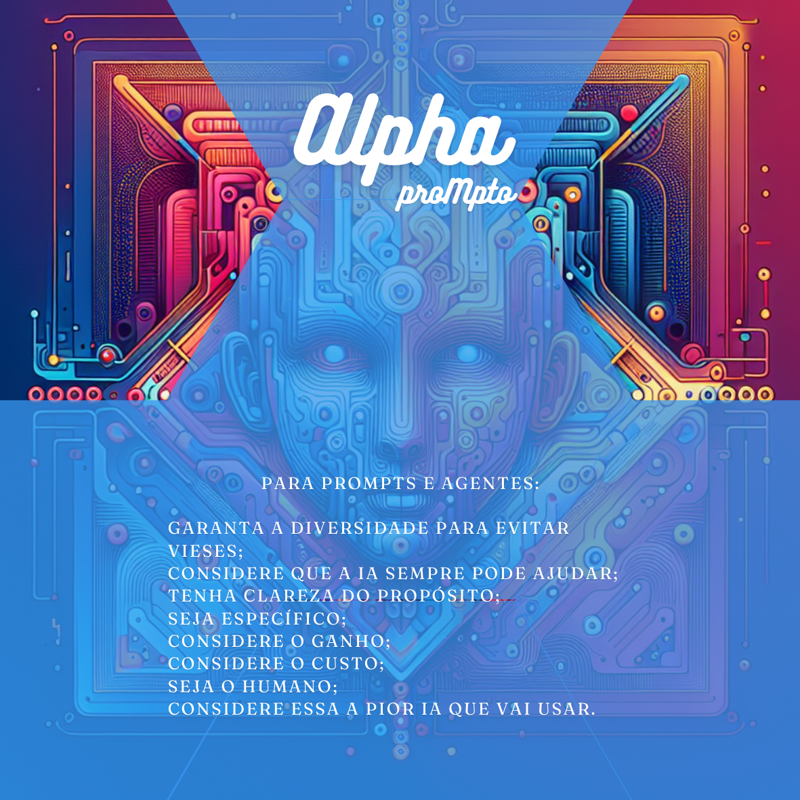

# A Jornada

A jornada do **Alpha (proMpto)** é um guia estruturado e lúdico para o **uso intencional e evolucionário de Inteligências Artificiais (IAs)** no dia a dia. 

Seu principal objetivo é ajudar a obter os melhores resultados ao interagir com IAs, desmistificando a "arquitetura de prompts" e a falsa ideia de que o uso da IA é complexo.

Essa jornada é composta por diversas camadas e dinâmicas, que se complementam para guiar o usuário na criação de *prompts* e Agentes de IA eficazes.

## Direções

As **Direções** são princípios fundamentais que guiam o uso estratégico e ético da IA, servindo como base para toda a jornada. Elas garantem que a IA seja utilizada de forma responsável e eficaz.

- **[Garanta a diversidade para evitar vieses](../../direcoes/garanta-a-diversidade.md)**: Essencial para mitigar vieses, assegurar justiça e promover a inclusão nos resultados gerados, levando a algoritmos mais representativos e imparciais. A falta de diversidade pode perpetuar discriminações.
- **[A IA sempre pode ajudar](../../direcoes/a-ia-sempre-pode-ajudar.md)**: Indica que, embora a IA tenha um potencial significativo para auxiliar em diversas áreas, sua aplicação deve ser avaliada criticamente quanto ao custo-benefício, aceitação dos usuários e impactos éticos e sociais. A IA pode ajudar em qualquer área ou atividade, mas nem sempre sua aplicação é a melhor solução.
- **[Tenha clareza do propósito](../../direcoes/tenha-clareza-do-proposito.md)**: É crucial definir o objetivo e a aplicação específica da IA para garantir eficiência e produtividade, evitando respostas incoerentes ou irrelevantes.
- **[Seja específico](../../direcoes/seja-especifico.md)**: Fundamental para obter resultados precisos e eficientes. Fornecer detalhes claros nos comandos (*prompts*) direciona a IA adequadamente, evitando ambiguidades. Quanto mais detalhes forem fornecidos, maior a chance de a IA gerar a resposta desejada.
- **[Considere o ganho](../../direcoes/considere-o-ganho.md)**: Avalia os benefícios tangíveis que a IA pode oferecer, como economia de tempo e melhoria do bem-estar, garantindo que o tempo investido seja inferior ao tempo economizado.
- **[Considere o custo](../../direcoes/considere-o-custo.md)**: Avalia os recursos necessários e os possíveis riscos envolvidos na implementação da IA, assegurando que os benefícios esperados justifiquem os custos e riscos associados.
- **[Seja o humano](../../direcoes/seja-o-humano.md)**: Enfatiza a importância de manter o controle e a perspectiva humana durante todo o processo, utilizando a IA para complementar habilidades, não substituí-las. O julgamento crítico e a ética devem permanecer sob domínio humano.
- **[Considere essa a pior IA que você vai usar](../../direcoes/considere-essa-a-pior-IA.md)**: Reconhece a rápida e constante evolução da IA, incentivando uma mentalidade de aprendizado e adaptação contínuos para sempre buscar as ferramentas mais recentes e eficazes.

## Trilhas

As trilhas são estruturas que organizam os caminhos e elementos para diferentes níveis e focos de interação com a IA.

1.  **[Trilha Principal](../../conceitos/jornada/trilha-principal.md)**: É a estrutura fundamental para o uso intencional de IAs, oferecendo passos flexíveis para a criação de *prompts* e Agentes eficazes. Ela engloba diversos caminhos.
2.  **[Trilha Básica](../../conceitos/jornada/trilha-basica.md)**: Representa o **conhecimento mínimo necessário** para o uso intencional e efetivo de IAs no dia a dia, sendo considerada essencial para que o "[O básico bem feito](prompt-basico.md)". É composta pelo Caminho da Consciência e o Caminho de Embasamento.
3.  **[Caminho para Criação](../conceitos/jornada/caminho-para-criacao.md)**: Uma trilha **alternativa** do Alpha (proMpto) focada em um conjunto de elementos que podem ser adicionados a *prompts* do tipo **[Criativo](../../tipos-de-prompt/criativo.md)** para refinar e direcionar a criação de conteúdo. O objetivo é tornar as solicitações mais específicas, resultando em produções mais alinhadas às expectativas.

### Caminhos

Os caminhos são grupos de elementos que visam aprimorar a interação e os resultados com a IA. Uma trilha pode ser composta por nenhum, um ou mais caminhos, inclusive você pode usar os caminhos para desenhar as suas próprias thilhas de aprendizado, de acordo com as suas necessidades.

- **[Caminho da Consciência](../../conceitos/jornada/caminho-da-consciencia.md)**: Refere-se aos elementos fundamentais para **decidir qual tipo de Agente ou *prompt* será usado** de forma intencional. Envolve a reflexão sobre qual tipo de IA melhor atenderá às necessidades específicas.
  - **[Tarefeiro](../../tipos-de-prompt/tarefeiro.md)**: Para solicitações de atividades comuns e repetitivas, com o objetivo de automatizar rotinas e economizar tempo.
  - **[Conselheiro](../../tipos-de-prompt/conselheiro.md)**: Usado para buscar opinião ou informação da IA, explorar possibilidades, alternativas ou validar caminhos. É crucial validar as informações, pois IAs não são factuais.
  - **[Criativo](../../tipos-de-prompt/criativo.md)**: Para solicitar criações, artes, histórias e atividades criativas em geral. É importante verificar direitos autorais, pois IAs podem plagiar.
  - **[Mais escolhas](../../tipos-de-prompt/mais-escolhas.md)**: Um modificador que adiciona restrições para **limitar as possibilidades de resposta da IA**, focando em opções específicas.

- **[Caminho da Produção](../../conceitos/jornada/caminho-da-procucao.md)**: Engloba os elementos práticos para estruturar os agentes e refinar os *prompts*, desde os fundamentos até a personalização da saída da IA. Acomoda vários outros caminhos mais específicos.
    *   **[Caminho de embasamento](../../conceitos/jornada/caminho-de-embasamento.md)**: Considera **[Papel](../../partes-de-prompt/papel.md), *[Ação](../../partes-de-prompt/acao.md) e [Contexto](../../partes-de-prompt/contexto.md)** como os itens mínimos necessários para a escrita de um bom *prompt* na maioria dos casos, tornando a solicitação mais clara e eficiente.
        *   **[Papel](../../partes-de-prompt/papel.md)**: Define a **função ou posição que a IA deve desempenhar** na requisição, direcionando o tom e a perspectiva.
        *   **[Ação](../../partes-de-prompt/acao.md)**: Detalha a **tarefa ou o resultado esperado da IA** de forma explícita e específica, delimitando como a IA deve proceder.
        *   **[Contexto](../../partes-de-prompt/contexto.md)**: Esclarece o **cenário, a situação ou o objetivo da solicitação**, fornecendo informações adicionais para que a IA trabalhe melhor e traga um resultado mais relevante.
    *   **[Caminho para controle](../../conceitos/jornada/caminho-para-controle.md)**: Adiciona elementos para garantir um resultado mais alinhado com as expectativas do usuário, controlando a forma como a IA entrega a informação.
        *   **[Formato](../../partes-de-prompt/controle/formato.md)**: Especifica **como a IA deve entregar o resultado da criação**, podendo incluir tabelas, códigos, desenhos, ou textos em um formato específico.
        *   **[Limites](../../partes-de-prompt/controle/limites.md)**: Define o que **você não deseja que a IA inclua na resposta**, atuando como instruções negativas para refinar os resultados.
        *   **[Mais personagem](../../partes-de-prompt/controle/mais-personagem.md)**: Permite refinar a persona ou o papel que a IA deve assumir, simulando o comportamento de uma pessoa conhecida ou fictícia, o que impacta o tom e o estilo.
        *   **[Mais audiência](../../partes-de-prompt/controle/mais-audiencia.md)**: Especifica o **público de interesse** que a IA deve considerar, alterando o resultado para ser mais focado e preciso.
    *   **[Caminho para Informação](../../conceitos/jornada/caminho-para-informação.md)**: Concentra-se em como fornecer informações adicionais e restrições para a IA para refinar os resultados obtidos.
        *   **[Exemplos](../../partes-de-prompt/informacao/exemplos.md)**: Fornece exemplos de como você espera que o resultado seja, demonstrando o formato e o conteúdo desejados.
        *   **[Limites](../../partes-de-prompt/controle/limites.md):** Impõe limites ou define o que não se deseja que a IA inclua na resposta ajuda, a direcionar ainda mais os resultados.
        *   **[Dados externos](../../partes-de-prompt/informacao/dados-externos.md)**: Informações necessárias ou complementares que não estão publicamente disponíveis para a IA, fornecidas diretamente no *prompt* ou por meio de anexos.

    *   **[Caminho para Criação](../../conceitos/jornada/caminho-para-criacao.md)**: Um conjunto de elementos que podem ser adicionados aos *prompts* com o objetivo de refinar e direcionar a **criação de conteúdo**, especialmente em *prompts* do tipo Criativo. É a base da **[Trilha da Criação](../../conceitos/jornada/trilha-da-criacao.md)**.
        *   **[Formato](../../partes-de-prompt/controle/formato.md):** (Também presente no **[Caminho para controle](../../conceitos/jornada/caminho-para-controle.md)**) Especifica como a IA deve entregar o resultado da criação.
        *   **[Assunto](../../partes-de-prompt/criacao/assunto.md)**: Define o **foco principal, o protagonista da criação**, sendo a parte primordial para um bom *prompt* criativo.
        *   **[Equipamento](../../partes-de-prompt/criacao/equipamento.md)**: Indica que a IA deve usar, ou simular o uso, de um **equipamento específico para sua criação**, lapidando a forma como o resultado é apresentado (ex: tipo de câmera para imagens, máquina de escrever antiga para textos).
        *   **[Mais lugar](../../partes-de-prompt/criacao/mais-lugar.md)r**: Especifica **o local, ano ou era que a criação deveria refletir**, adicionando especificidade e influenciando as características.
        *   **[Mais hora](../../partes-de-prompt/criacao/mais-hora.md)**: Define **a hora do dia, ou o momento, que a criação deve refletir**, impactando a atmosfera geral (ex: iluminação em imagens, tom em uma música).
        *   **[Mais atuação](../../partes-de-prompt/criacao/mais-atuacao.md)**: Descreve a **ação, emoção ou sentimento do sujeito central da criação** que a IA deve realizar, especificando como o ponto focal deve se comportar.
        *   **[Mais estilo](../../partes-de-prompt/criacao/mais-estilo.md)**: Indica **qual será o estilo usado pela IA para a criação**, abrangendo época, contexto e localização, para um resultado mais adequado (ex: retrofuturista, satírico, Rock Pop).

3.  **[Caminho para Transcendência](../../conceitos/jornada/caminho-para-transcendencia.md)**: Refere-se aos passos ou elementos que vêm "**depois do *prompt***" e visam aprimorar e continuar a interação com a IA, em um processo de melhoria contínua.
    *   **[Ajuste](../../depois-do-prompt/ajuste-ou-continue.md#ajuste)**: Se a resposta inicial não foi adequada, basta **Ajustar o *prompt*** e repetir o processo, podendo incluir ou retirar elementos.
    *   **[Continue a conversa](../../depois-do-prompt/ajuste-ou-continue.md#continue-a-conversa)**: Quando o *prompt* inicial já obteve o resultado esperado, pode-se **continuar a conversa para refinar ou aprofundar** o resultado, com um novo *prompt* que pode ser mais simples, pois a IA acumula aprendizado.
    *   **[Use diferentes agentes](../../depois-do-prompt/use-diferentes-agentes.md)**: Mesmo após ajustes, pode-se explorar mais as capacidades da IA utilizando **diferentes Agentes ou Modelos de IA** para obter resultados distintos e potencializar ações, inclusive colocando IAs para "conversar" entre si.

### Dinâmicas Acessórias

Além dos elementos dos *prompts*, a jornada do Alpha (proMpto) inclui dinâmicas interativas:

*   **[AI Planning Poker](../../tipos-de-prompt/cocriacao.md#ai-planing-poker)**: Uma dinâmica recomendada para **definir o uso intencional de IA** em uma rotina de equipe, determinar a natureza ideal desse uso e facilitar o diálogo sobre os custos e benefícios específicos.
*   **Solitary AI Poker**: Dinâmica Individual para decisão sobre os melhores usos de IA na solução de problemas específicos.
*   **[Mood Board Game](partes-de-prompt/criacao/mood-board-game.md)**: Um jogo **colaborativo e criativo** que utiliza IAs para a **construção de um *mood board*** (painel de inspiração) com base em temas e *prompts*. Ele se encaixa perfeitamente na **[Trilha da Criação](../../conceitos/jornada/trilha-da-criacao.md)** por ser uma aplicação prática e lúdica de seus elementos, encorajando os participantes a refinar suas solicitações e obter criações mais alinhadas às expectativas.
*   **Inspiration Game**: Dinâmica para inspiração indivudual sobre o uso de IA para criações.

Em todas as etapas da jornada do Alpha (proMpto), é fundamental a **responsabilidade do humano** na curadoria, verificação e validação dos resultados gerados pela IA, incluindo os direitos autorais, pois as IAs não são factuais e podem "inventar" informações ou plagiar.

A jornada do Alpha (proMpto) busca a **transcendência** no uso da IA, em um processo de melhoria contínua onde o usuário evolui para superar sua competência atual, inovando em suas vidas e profissões.

Se você busca transcender no uso da IA e obter criações cada vez mais precisas e personalizadas, a jornada do Alpha (proMpto) é o seu próximo passo!

<a property="dct:title" rel="cc:attributionURL" href="https://davifma.github.io/proMpto/">prompto.github.io</a> by <a rel="cc:attributionURL dct:creator" property="cc:attributionName" href="http://linkedin.com/in/davifma">Davi Fontebasso Marques de Almeida</a> is licensed under <a href="https://creativecommons.org/licenses/by/4.0/?ref=chooser-v1" target="_blank" rel="license noopener noreferrer" style="display:inline-block;">Creative Commons Attribution 4.0 International </a>

