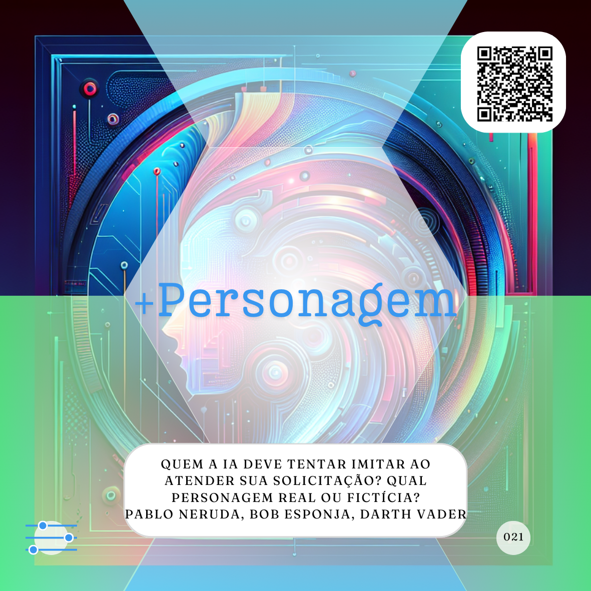
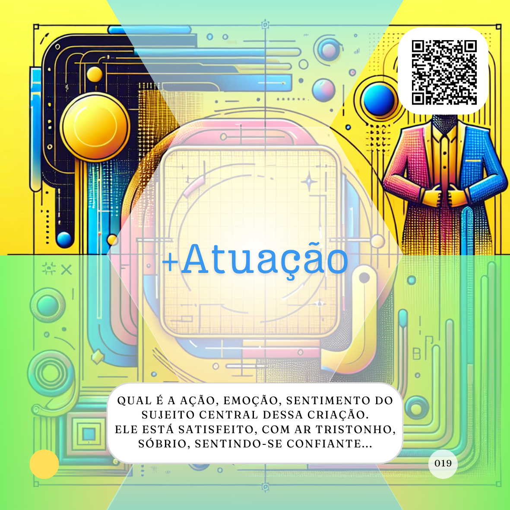
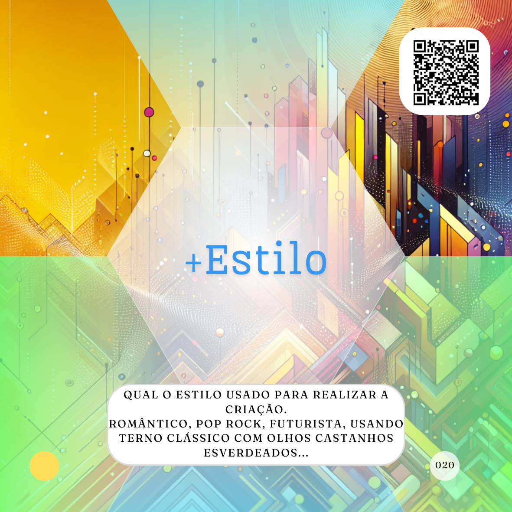

# Caminho da Produção

O **Caminho da Produção** é uma dos maiores caminhos de aprendizado dentro do **Alpha (proMpto)** e representa um conjunto de estratégias e elementos para refinar a interação com Inteligências Artificiais (IAs) e otimizar a obtenção de resultados desejados. Ele é composto por quatro caminhos distintos, mas interconectados: o **[Caminho de embasamento](../../conceitos/jornada/caminho-de-embasamento.md)**, o **[Caminho para controle](../../conceitos/jornada/caminho-para-controle.md)**, o **[Caminho para Informação](../../conceitos/jornada/caminho-para-informacao.md)** e o **[Caminho para Criação](../../conceitos/jornada/caminho-para-criacao.md)**. O objetivo do Caminho da Produção é fornecer uma estrutura para construir *prompts* mais eficazes, independentemente do tipo de tarefa, Agente de IA ou, até, modelo utilizado.

    

  

            

    

O **[Caminho de embasamento](../../conceitos/jornada/caminho-de-embasamento.md)** é considerado a base para a escrita de um bom *prompt* na maioria dos casos. Ele é composto por três elementos essenciais:

*   **[Papel](../../partes-de-prompt/papel.md):** Define a função que a IA deve desempenhar na resposta. Atribuir um papel específico ajuda a direcionar o tom, a profundidade e a perspectiva da resposta. Por exemplo, solicitar à IA para agir "Como se você fosse um especialista em...". A definição do papel é um dos itens básicos para um bom *prompt*.
*   **[Ação](../../partes-de-prompt/acao.md):** Detalha a tarefa ou o resultado esperado da IA. É uma descrição explícita e específica do que deve ser feito. Uma ação bem definida muda a intencionalidade do *prompt*, delimitando como a IA deve proceder. É importante ser o mais específico possível ao definir a ação.
*   **[Contexto](../../partes-de-prompt/contexto.md):** Esclarece o cenário, a situação ou o objetivo da solicitação. O contexto fornece informações adicionais para que a IA trabalhe melhor e traga um resultado mais relevante. Incluir o contexto ajuda a IA a focar em informações específicas e a entender a realidade na qual o resultado será aplicado. Ter contexto é uma característica básica para um *prompt* bem escrito.

Esses três elementos também compõem a **Trilha Básica** para o uso intencional de IAs e são suficientes para muitas solicitações do dia a dia.

O **[Caminho para controle](../../conceitos/jornada/caminho-para-controle.md)** visa refinar ainda mais os resultados da IA, permitindo ao usuário direcionar a forma como a informação é entregue e quais limites devem ser considerados. Os principais componentes deste caminho são:

*   **[Formato](../../partes-de-prompt/controle/formato.md):** Especifica como a IA deve entregar o resultado. Isso pode incluir tabelas, códigos, desenhos, textos em um formato específico (como um parágrafo único com ingredientes listados) ou um roteiro. Definir o formato desejado controla a apresentação da informação gerada.
*   **[Limites](../../partes-de-prompt/controle/limites.md):** Impõe restrições ou define o que não se deseja que a IA inclua na resposta. Limites podem ser vistos como instruções negativas, especificando os itens que se quer que o Agente retire ou nem mesmo considere. Por exemplo, limitar o número de linhas em uma descrição.
*   **[Mais personagem](../../partes-de-prompt/controle/mais-personagem.md):** Este elemento solicita que a IA simule o comportamento de uma pessoa específica ao gerar a resposta. Ao pedir que a IA adote um determinado papel ou imite a forma de escrita e o tom de voz de alguém (como um professor de culinária ou um chef renomado como Gordon Ramsay), você limita a busca da IA e direciona o resultado com base nas características conhecidas dessa personagem. Isso pode influenciar o tom, a profundidade e a perspectiva da criação. A inclusão de uma personagem específica torna o prompt mais específico.
*   **[Mais audiência](../../partes-de-prompt/controle/mais-audiencia.md):** Este componente direciona a IA a considerar o público de interesse ao executar o que lhe foi pedido. Assim como consideramos o público ao realizar qualquer criação para terceiros, o mesmo raciocínio se aplica às IAs Generativas. Estreitar o público-alvo de uma produção tende a alterar bastante o resultado, tornando-se um novo parâmetro a ser considerado no prompt. Ao especificar a audiência (por exemplo, adolescentes da geração Z ou líderes de produção de uma indústria automotiva), você instrui a IA a gerar um resultado mais focado, mais preciso e personalizado para esse público específico. A consideração da audiência direciona o discurso e limita as possibilidades na produção da IA.

O **[Caminho para Informação](../../conceitos/jornada/caminho-para-informação.md)** concentra-se em como fornecer dados adicionais e restrições para a IA, a fim de refinar ainda mais os resultados. Ele é composto por:

*   **[Exemplos](../../partes-de-prompt/informacao/exemplos.md):** Fornecer exemplos ao Agente de IA é uma maneira eficaz de mostrar como se espera que o resultado seja. Mesmo que as IAs tenham acesso a muita informação, exemplos demonstram o formato e o conteúdo desejados. Dar exemplos facilita a comunicação com a IA, tornando as expectativas mais claras.
*   **[Limites](../../partes-de-prompt/controle/limites.md):** **[Caminho para controle](../../conceitos/jornada/caminho-para-controle.md)** Impor limites ou definir o que não se deseja que a IA inclua na resposta ajuda a direcionar ainda mais os resultados.
*   **[Dados externos](../../partes-de-prompt/informacao/dados-externos.md):** São informações necessárias ou complementares que não estão publicamente disponíveis para a IA. Para que a IA trabalhe com esses dados, é preciso fornecê-los, seja copiando e colando ou anexando arquivos. A inclusão de dados externos se alinha com o Modelo GROW, especificamente com a necessidade de informações para avaliar a "Realidade".

O **[Caminho para Criação](../../conceitos/jornada/caminho-para-criacao.md)** é especialmente relevante para *prompts* do tipo **Criativo** e visa refinar e direcionar a geração de conteúdo. Os componentes deste caminho são:

*   **[Formato](../../partes-de-prompt/controle/formato.md):** (Também presente no **[Caminho para controle](../../conceitos/jornada/caminho-para-controle.md)**) Especifica como a IA deve entregar o resultado da criação.
*   **[Assunto](../../partes-de-prompt/criacao/assunto.md):** Define o foco principal, o protagonista da criação. É primordial para um bom *prompt* criativo.
*   **[Equipamento](../../partes-de-prompt/criacao/equipamento.md):** Indica que a IA deve usar ou simular o uso de um equipamento específico para sua criação.
*   **[Mais lugar](../../partes-de-prompt/criacao/mais-lugar.md):** Especifica o local, ano ou era que a criação deveria refletir.
*   **[Mais hora](../../partes-de-prompt/criacao/mais-hora.md):** Define a hora do dia ou o momento que a criação deve refletir.
*   **[Mais atuação](../../partes-de-prompt/criacao/mais-atuacao.md):** Descreve a ação, emoção ou sentimento do sujeito central da criação.
*   **[Mais estilo](../../partes-de-prompt/criacao/mais-estilo.md):** Indica qual será o estilo usado pela IA para realizar a criação.

Ao utilizar os elementos do **Caminho da Produção**, o usuário busca maior controle, especificidade e alinhamento dos resultados gerados pela IA com suas expectativas. É importante lembrar que, mesmo com *prompts* bem elaborados, a responsabilidade pela curadoria e verificação das informações e direitos autorais permanece com o humano. A **[Bússola de Implantação](../../direcoes/bussola.md)** também reforça a importância de ser específico ao interagir com a IA para obter resultados precisos. O **[Uso evolucionário de IAs](../../uso-evolucionario-de-ias.md)** demonstra como a combinação desses elementos pode levar a resultados cada vez mais refinados.

## Relações
- ### [Direções](direcoes/)
  - #### [Seja específico](direcoes/seja-especifico.md)
  - #### [Seja o humano](direcoes/seja-o-humano.md)
- ### [Bússola de Implantação](direcoes/bussola.md) 
- ### Trilha Principal
- #### [Uso evolucionário de IAs](uso-evolucionario-de-ias.md) 
- #### [Caminho da Consciência](conceitos/jornada/caminho-da-consciencia.md)
  - [Tarefeiro](tipos-de-prompt/tarefeiro.md)
  - [Conselheiro](tipos-de-prompt/conselheiro.md)
  - [Criativo](tipos-de-prompt/criativo.md)
  - [Mais escolhas](tipos-de-prompt/mais-escolhas.md)
- #### Caminho da Produção
  - ##### [Caminho de embasamento](conceitos/jornada/caminho-de-embasamento.md)
    - [Papel](partes-de-prompt/papel.md)
    - [Ação](partes-de-prompt/acao.md)
    - [Contexto](partes-de-prompt/contexto.md)
  - ##### [Caminho para controle](conceitos/jornada/caminho-para-controle.md)
      - [Formato](partes-de-prompt/controle/formato.md)
      - [Limites](partes-de-prompt/controle/limites.md)
      - [Mais personagem](partes-de-prompt/controle/mais-personagem.md)
      - [Mais audiência](partes-de-prompt/controle/mais-audiencia.md)
  - ##### [Caminho para Informação](conceitos/jornada/caminho-para-informacao.md)
      - [Exemplos](partes-de-prompt/informacao/exemplos.md)
      - [Limites](partes-de-prompt/controle/limites.md)
      - [Dados externos](partes-de-prompt/informacao/dados-externos.md)
  - ##### [Caminho para Criação](conceitos/jornada/caminho-para-criacao.md)
      - [Formato](partes-de-prompt/controle/formato.md)
      - [Assunto](partes-de-prompt/criacao/assunto.md)
      - [Equipamento](partes-de-prompt/criacao/equipamento.md)
      - [Mais lugar](partes-de-prompt/criacao/mais-lugar.md)
      - [Mais hora](partes-de-prompt/criacao/mais-hora.md)
      - [Mais atuação](partes-de-prompt/criacao/mais-atuacao.md)
      - [Mais estilo](partes-de-prompt/criacao/mais-estilo.md) 
- ### Trilha Básica
  - [Tarefeiro](tipos-de-prompt/tarefeiro.md)
  - [Conselheiro](tipos-de-prompt/conselheiro.md)
  - [Criativo](tipos-de-prompt/criativo.md)
  - [Mais escolhas](tipos-de-prompt/mais-escolhas.md)
  - [Papel](partes-de-prompt/papel.md)
  - [Ação](partes-de-prompt/acao.md)
  - [Contexto](partes-de-prompt/contexto.md)
- ### Trilha da Criação
  - [Criativo](tipos-de-prompt/criativo.md)
  - [Mais escolhas](tipos-de-prompt/mais-escolhas.md)
  - [Papel](partes-de-prompt/papel.md)
  - [Ação](partes-de-prompt/acao.md)
  - [Contexto](partes-de-prompt/contexto.md)
    - [Mais lugar](partes-de-prompt/criacao/mais-lugar.md)
    - [Mais hora](partes-de-prompt/criacao/mais-hora.md)
  - [Formato](partes-de-prompt/controle/formato.md)
  - [Assunto](partes-de-prompt/criacao/assunto.md)
    - [Mais atuação](partes-de-prompt/criacao/mais-atuacao.md)
    - [Mais estilo](partes-de-prompt/criacao/mais-estilo.md) 
  - [Equipamento](partes-de-prompt/criacao/equipamento.md)  

<a property="dct:title" rel="cc:attributionURL" href="https://davifma.github.io/proMpto/">prompto.github.io</a> by <a rel="cc:attributionURL dct:creator" property="cc:attributionName" href="http://linkedin.com/in/davifma">Davi Fontebasso Marques de Almeida</a> is licensed under <a href="https://creativecommons.org/licenses/by/4.0/?ref=chooser-v1" target="_blank" rel="license noopener noreferrer" style="display:inline-block;">Creative Commons Attribution 4.0 International </a>

