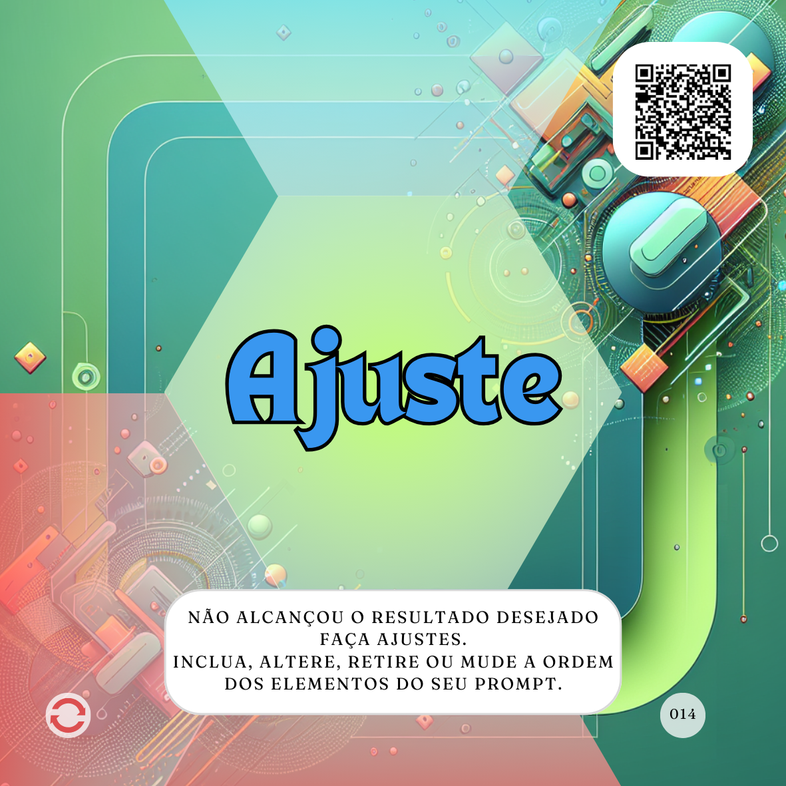

# Caminho para Transcendência 

O **Caminho para Transcendência** é um dos caminhos que compõem o Alpha (proMpto). Ele se refere aos passos ou elementos que vêm "depois do prompt" e visam aprimorar e continuar a interação com a Inteligência Artificial (IA).

Este caminho é formado por três possíveis passos:
 - **[Ajuste](../../depois-do-prompt/ajuste-ou-continue.md#ajuste)**
 - **[Continue a conversa](../../depois-do-prompt/ajuste-ou-continue.md#continue-a-conversa)**
 - **[Use diferentes agentes](../../depois-do-prompt/use-diferentes-agentes.md)**

A ideia central do Caminho para Transcendência está alinhada com um uso evolucionário das IAs. Em vez de buscar uma revolução, o objetivo é melhorar a forma como as tarefas já são realizadas, usando a IA para fazê-las com mais qualidade e em menos tempo, em um processo de melhoria contínua.

     

Vamos detalhar cada um dos elementos que compõem este caminho:

 - **[Ajuste](../../depois-do-prompt/ajuste-ou-continue.md#ajuste)**: Este passo é um lembrete de que o trabalho com IAs é evolucionário. Se a resposta inicial de um prompt não foi adequada ou não atingiu as expectativas, basta Ajustar o proMpt e repetir o processo quantas vezes for necessário, desde que haja um bom custo-benefício. Ajustar um prompt pode envolver a inclusão de novos elementos, como mais **[Contexto](../../partes-de-prompt/contexto.md)**, **[Formato](../../partes-de-prompt/controle/formato.md)** ou "**[Exemplos](../../partes-de-prompt/informacao/exemplos.md)**. Também é possível retirar, inverter a ordem ou reescrever alguma parte do prompt. O objetivo é alcançar o resultado desejado.
 - **[Continue a conversa](../../depois-do-prompt/ajuste-ou-continue.md#continue-a-conversa)**: Esta possibilidade surge quando o prompt inicial já obteve o resultado esperado. Mesmo satisfeito, pode valer a pena continuar a conversa para refinar ou aprofundar o resultado, especialmente em trabalhos mais complexos e longos. Continuar a conversa significa escrever um novo proMpt, que pode ser até mais simples, pois o Agente de IA acumulará o aprendizado com o proMpt anterior. Isso permite lapidar ou aprofundar os resultados em um processo útil e único de melhoria contínua.
 - **[Use diferentes agentes](../../depois-do-prompt/use-diferentes-agentes.md)**: Mesmo após obter um resultado satisfatório [ajustando](../../depois-do-prompt/ajuste-ou-continue.md#ajuste) o proMpt ou [continuando a conversa](../../depois-do-prompt/ajuste-ou-continue.md#continue-a-conversa), é provável que ainda se possa explorar mais as capacidades da IA utilizando diferentes Agentes de Inteligência Artificial ou diferentes Modelos de IA. Agentes são ferramentas que utilizam IA para um fim específico, como o ChatGPT, que usa o Modelo GPT. Usar diferentes Agentes pode trazer resultados distintos e potencializar as ações. Embora seja comum usar Agentes diferentes para funções diferentes, como usar um Agente Criativo para imagens e um Tarefeiro para pesquisas, outra prática é unir vários Agentes com um único propósito, colocando-os para "conversar" entre si, muitas vezes usando o mesmo proMpt em vários Agentes para cruzar informações.
   
Em essência, o **Caminho para Transcendência** foca na melhoria contínua da interação com a IA após a primeira resposta. Ele incentiva o usuário a iterar no proMpt (**[Ajuste](../../depois-do-prompt/ajuste-ou-continue.md#ajuste)**), a explorar mais a fundo o tema (**[Continue a conversa](../../depois-do-prompt/ajuste-ou-continue.md#continue-a-conversa)**) e a diversificar as ferramentas de IA utilizadas (**[Use diferentes agentes](../../depois-do-prompt/use-diferentes-agentes.md)**) para alcançar resultados cada vez melhores.

É fundamental lembrar que, em todas essas etapas, o humano é o responsável pelos resultados gerados pela IA, devendo verificar, validar e garantir a qualidade e veracidade das informações, bem como os direitos autorais no caso de criações. A supervisão humana é essencial para identificar falhas, garantir a ética e adaptar a IA às necessidades.

## Relações
- ### [Direções](direcoes/)
  - #### [Seja o humano](direcoes/seja-o-humano.md)
- ### [Trilha Principal](../../conceitos/jornada/trilha-principal.md)
- #### [Tipos de proMpts e Agentes](tipos-de-prompt/README.md)
- #### [Uso evolucionário de IAs](uso-evolucionario-de-ias.md) 
- #### [Caminho da Consciência](conceitos/jornada/caminho-da-consciencia.md)
  - [Tarefeiro](tipos-de-prompt/tarefeiro.md)
  - [Conselheiro](tipos-de-prompt/conselheiro.md)
  - [Criativo](tipos-de-prompt/criativo.md)
  - [Mais escolhas](tipos-de-prompt/mais-escolhas.md)
- #### [Caminho da Produção](conceitos/jornada/caminho-da-procucao.md)
  - ##### [Caminho de embasamento](conceitos/jornada/caminho-de-embasamento.md)
    - [Papel](partes-de-prompt/papel.md)
    - [Ação](partes-de-prompt/acao.md)
    - [Contexto](partes-de-prompt/contexto.md)
  - ##### [Caminho para controle](conceitos/jornada/caminho-para-controle.md)
      - [Formato](partes-de-prompt/controle/formato.md)
      - [Limites](partes-de-prompt/controle/limites.md)
      - [Mais personagem](partes-de-prompt/controle/mais-personagem.md)
      - [Mais audiência](partes-de-prompt/controle/mais-audiencia.md)
  - ##### [Caminho para Informação](conceitos/jornada/caminho-para-informacao.md)
      - [Exemplos](partes-de-prompt/informacao/exemplos.md)
      - [Limites](partes-de-prompt/controle/limites.md)
      - [Dados externos](partes-de-prompt/informacao/dados-externos.md)
  - ##### [Caminho para Criação](conceitos/jornada/caminho-para-criacao.md)
      - [Formato](partes-de-prompt/controle/formato.md)
      - [Assunto](partes-de-prompt/criacao/assunto.md)
      - [Equipamento](partes-de-prompt/criacao/equipamento.md)
      - [Mais lugar](partes-de-prompt/criacao/mais-lugar.md)
      - [Mais hora](partes-de-prompt/criacao/mais-hora.md)
      - [Mais atuação](partes-de-prompt/criacao/mais-atuacao.md)
      - [Mais estilo](partes-de-prompt/criacao/mais-estilo.md)
- #### Caminho para Transcendência
  - [Ajuste](../../depois-do-prompt/ajuste-ou-continue.md#ajuste)
  - [Continue a conversa](../../depois-do-prompt/ajuste-ou-continue.md#continue-a-conversa)
  - [Use diferentes agentes](../../depois-do-prompt/use-diferentes-agentes.md)
