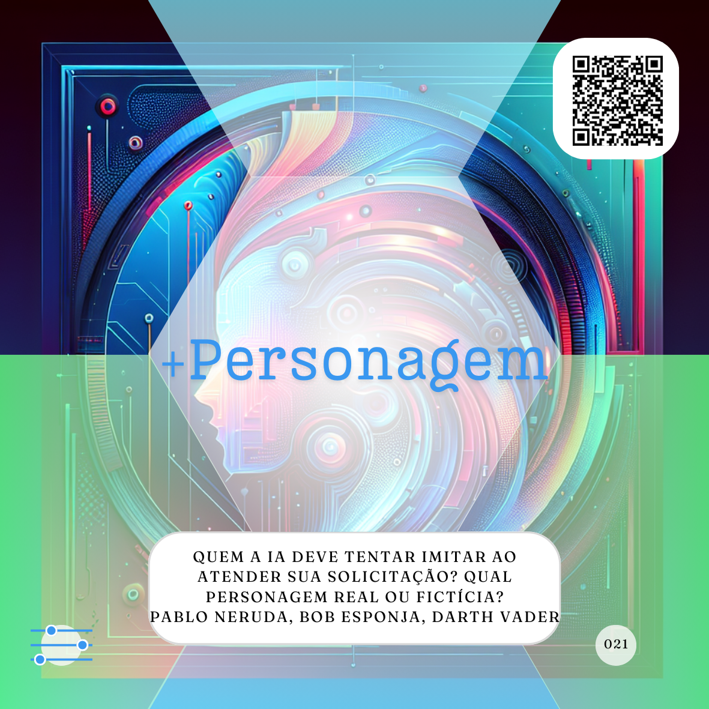
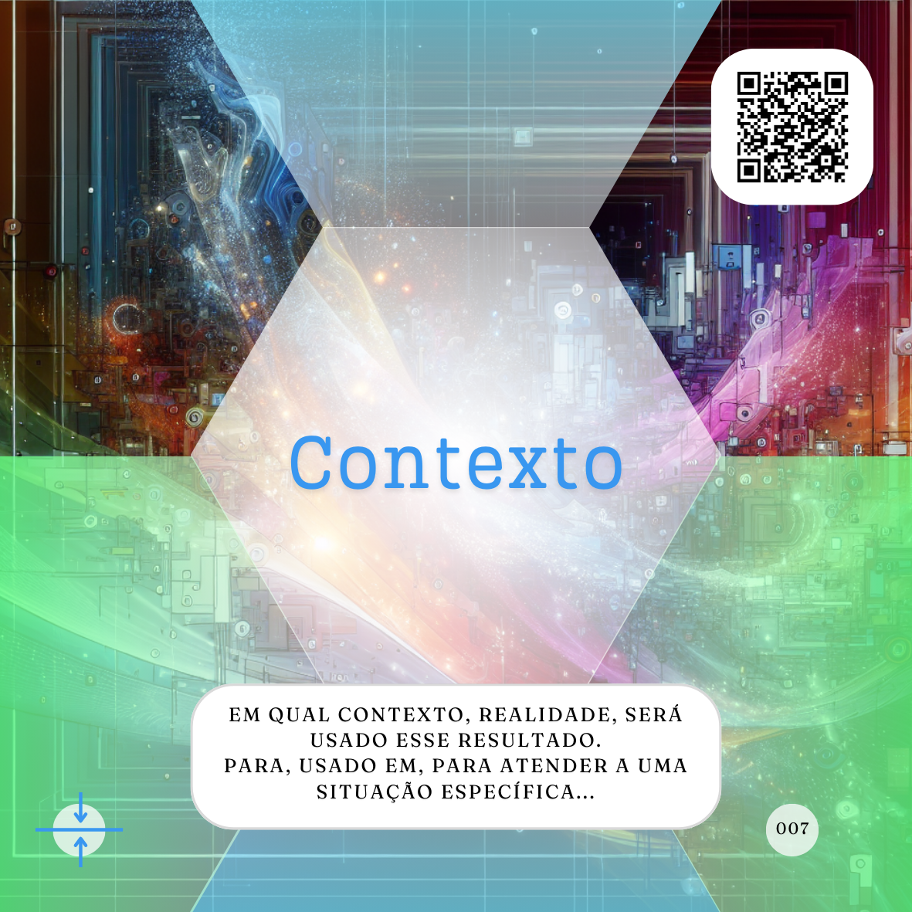
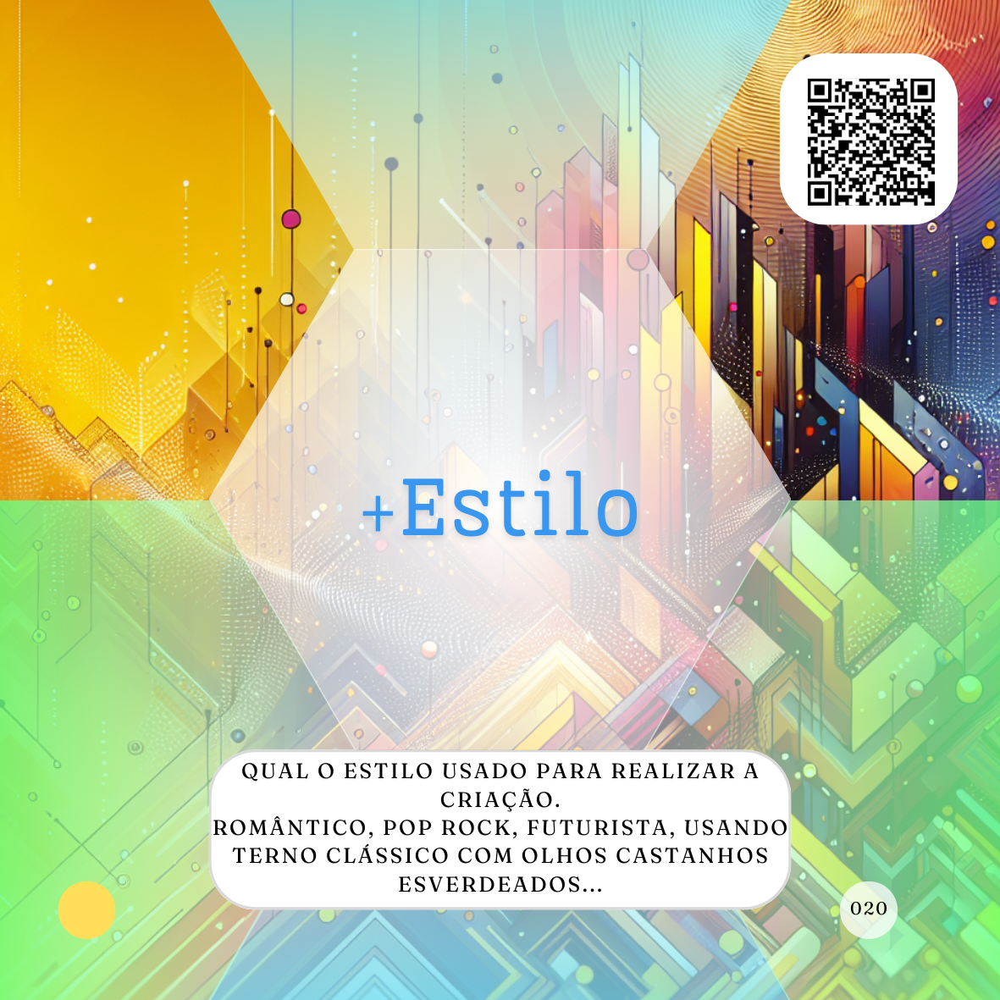
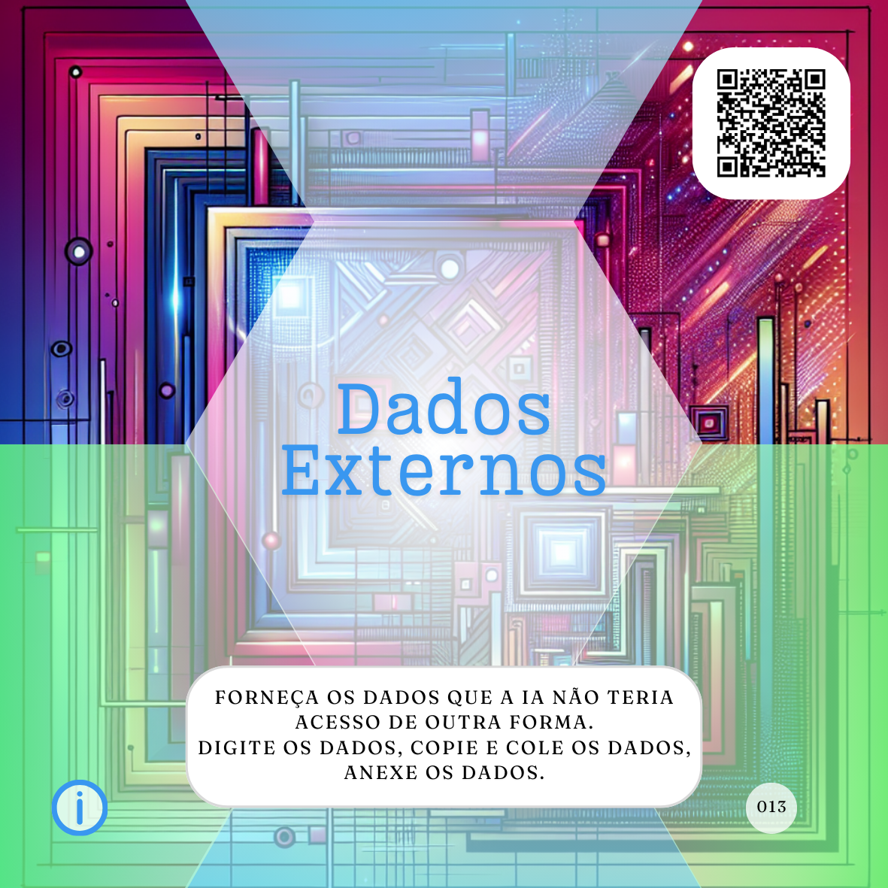

# Trilha Principal

A **Trilha Principal** do Alpha (proMpto) é uma estrutura fundamental para o uso intencional de Inteligências Artificiais (IAs). Ela oferece passos flexíveis para a criação de prompts e Agentes de Inteligência Artificial (Agentes) eficazes, guiando o usuário através de diferentes aspectos a serem considerados ao interagir com a IA. 

A **Trilha Principal** é composta pelos seguintes caminhos:

- **[Caminho da Consciência](../../conceitos/jornada/caminho-da-consciencia.md):** Este caminho é crucial para decidir qual tipo de agente ou prompt utilizar de forma intencional, ou seja, para qual tipo de uso você deveria focar a Inteligência Artificial (IA). Ele engloba os seguintes elementos, que representam os tipos básicos de usos da IA:
  - **[Tarefeiro](../../tipos-de-prompt/tarefeiro.md):** Usado para atividades comuns e repetitivas, onde a IA executa tarefas específicas e bem definidas sem propor novas informações ou simular uma criação, com o objetivo de automatizar rotinas e economizar tempo.
  - **[Conselheiro](../../tipos-de-prompt/conselheiro.md):** Empregado quando se busca a opinião ou informação da IA para explorar possibilidades, alternativas ou validar caminhos conhecidos. A IA atua como um especialista, fornecendo orientação, mas é importante validar as informações geradas.
  - **[Criativo](../../tipos-de-prompt/criativo.md):** Utilizado para solicitar criações, artes, histórias e atividades criativas em geral, como imagens, vídeos, textos ou poesias.
  - **[Mais escolhas](../../tipos-de-prompt/mais-escolhas.md):** Um modificador que pode ser aplicado a qualquer tipo de prompt, mas é mais comum em prompts do tipo “Conselheiro”, adicionando restrições e limitando as possibilidades de resposta da IA para focar em opções específicas. Embora também possa ser aplicado na construção de agentes entendo que não é tão comum.
 
- **[Caminho da Produção](../../conceitos/jornada/caminho-da-procucao.md):** Este caminho engloba os elementos práticos para estruturar os agentes e refinar os prompts, desde os fundamentos até a personalização da saída da IA. Ele acomoda vários outros caminhos mais específicos e focados:
  - **[Caminho de embasamento](../../conceitos/jornada/caminho-de-embasamento.md):** Considerado como os itens mínimos necessários para a escrita de um bom prompt na maioria dos casos. Estes componentes ajudam a estruturar a solicitação à IA, tornando-a mais clara e eficiente.
    - **[Papel](../../partes-de-prompt/papel.md):** Define a função que a IA deve desempenhar na resposta, direcionando o tom, a profundidade e a perspectiva.
    - **[Ação](../../partes-de-prompt/acao.md):** Detalha a tarefa ou resultado esperado da IA de forma explícita e específica, mudando a intencionalidade do prompt.
    - **[Contexto](../../partes-de-prompt/contexto.md):** Esclarece o cenário, a situação ou o objetivo da solicitação, fornecendo informações adicionais para que a IA trabalhe melhor e traga um resultado mais relevante.
  - **[Caminho para controle](../../conceitos/jornada/caminho-para-controle.md):** Adiciona elementos para garantir um resultado mais alinhado com as expectativas do usuário, controlando a forma como a IA entrega a informação.
    - **[Formato](../../partes-de-prompt/controle/formato.md):** Especifica como a IA deve entregar o resultado, como tabelas, códigos, desenhos, vídeos, textos em um formato específico.
    - **[Limites](../../partes-de-prompt/controle/limites.md):** Define o que você não deseja que a IA inclua na resposta, atuando como instruções negativas para refinar os resultados.
    - **[Mais personagem](../../partes-de-prompt/controle/mais-personagem.md):** Permite refinar a persona ou o papel que a IA deve assumir, influenciando o tom, o estilo e as características do resultado para alinhar-se com as expectativas do usuário.
    - **[Mais audiência](../../partes-de-prompt/controle/mais-audiencia.md):** Especifica o público de interesse que a IA deve considerar ao executar o que lhe foi pedido, alterando significativamente o resultado para ser mais focado e preciso.
  - **[Caminho para Informação](../../conceitos/jornada/caminho-para-informacao.md):** Concentra-se em como fornecer informações adicionais e restrições para a IA a fim de refinar os resultados obtidos.
    - **[Exemplos](../../partes-de-prompt/informacao/exemplos.md):** Fornecer exemplos ao Agente de IA é uma maneira eficaz de mostrar como você espera que o resultado seja, demonstrando o formato e o conteúdo desejados.
    - **[Limites](../../partes-de-prompt/controle/limites.md):** _(Repetido do "**[Caminho para controle](../../conceitos/jornada/caminho-para-controle.md)**" indicando sua dupla função de controlar a saída e informar a IA sobre restrições)_.
    - **[Dados externos](../../partes-de-prompt/informacao/dados-externos.md):** Informações necessárias ou complementares que não estão publicamente disponíveis para a IA, fornecidas diretamente no prompt ou por meio de anexos para que a IA possa trabalhar com elas.
  - **[Caminho para Criação](../../conceitos/jornada/caminho-para-criacao.md):** Um conjunto de elementos que podem ser adicionados aos prompts criativos para refinar e direcionar a criação de conteúdo, tornando as solicitações mais específicas.
    - **[Formato](../../partes-de-prompt/controle/formato.md):** _(Repetido do "**[Caminho para controle](../../conceitos/jornada/caminho-para-controle.md)**", aplicável também à criação para definir a apresentação do conteúdo)_.
    - **[Assunto](../../partes-de-prompt/criacao/assunto.md):** Define o foco principal, o protagonista da criação, sendo primordial para um bom prompt criativo.
    - **[Equipamento](../../partes-de-prompt/criacao/equipamento.md):** Indica que a IA deve usar ou simular o uso de um equipamento específico para sua criação, lapidando a forma como o resultado é apresentado.
    - **[Mais lugar](../../partes-de-prompt/criacao/mais-lugar.md):** Especifica o local, ano ou era que a criação deveria refletir, adicionando especificidade e influenciando as características da criação.
    - **[Mais hora](../../partes-de-prompt/criacao/mais-hora.md):** Define a hora do dia ou o momento que a criação deve refletir, impactando a atmosfera geral.
    - **[Mais atuação](../../partes-de-prompt/criacao/mais-atuacao.md):** Descreve a ação, emoção ou sentimento do sujeito central da criação que a IA deve realizar, especificando como o ponto focal deve se comportar.
    - **[Mais estilo](../../partes-de-prompt/criacao/mais-estilo.md):** Indica qual será o estilo usado pela IA para realizar a criação, abrangendo época, contexto e localização de criações semelhantes.

   

    

  

            

    

Ao compreender e aplicar os elementos de cada caminho da **Trilha Principal**, o usuário pode estruturar agentes e prompts mais eficazes, obter resultados mais alinhados às suas necessidades e utilizar a IA de forma mais intencional e produtiva. A **Trilha Básica** (**[Papel](../../partes-de-prompt/papel.md)**, **[Ação](../../partes-de-prompt/acao.md)** e **[Contexto](../../partes-de-prompt/contexto.md)**) é um ponto de partida essencial, e os demais caminhos permitem refinar e enriquecer ainda mais as interações com a IA.

## Relações
- ### [Direções](direcoes/)
  - #### [Seja específico](direcoes/seja-especifico.md)
  - #### [Seja o humano](direcoes/seja-o-humano.md)
- ### Trilha Principal
- #### [Tipos de proMpts e Agentes](tipos-de-prompt/README.md)
- #### [Um mapa para infinitos proMpts](um-mapa-para-infinitos-prompts.md)
  - ##### [O básico bem feito](prompt-basico.md)
  - ##### [Completo ou complexo?](prompts-complexos.md) 
  - ##### [Cocriando sua IA](tipos-de-prompt/cocriacao.md)
- #### [Uso evolucionário de IAs](uso-evolucionario-de-ias.md) 
- #### [Caminho da Consciência](conceitos/jornada/caminho-da-consciencia.md)
  - [Tarefeiro](tipos-de-prompt/tarefeiro.md)
  - [Conselheiro](tipos-de-prompt/conselheiro.md)
  - [Criativo](tipos-de-prompt/criativo.md)
  - [Mais escolhas](tipos-de-prompt/mais-escolhas.md)
- #### [Caminho da Produção](conceitos/jornada/caminho-da-procucao.md)
  - ##### [Caminho de embasamento](conceitos/jornada/caminho-de-embasamento.md)
    - [Papel](partes-de-prompt/papel.md)
    - [Ação](partes-de-prompt/acao.md)
    - [Contexto](partes-de-prompt/contexto.md)
  - ##### [Caminho para controle](conceitos/jornada/caminho-para-controle.md)
      - [Formato](partes-de-prompt/controle/formato.md)
      - [Limites](partes-de-prompt/controle/limites.md)
      - [Mais personagem](partes-de-prompt/controle/mais-personagem.md)
      - [Mais audiência](partes-de-prompt/controle/mais-audiencia.md)
  - ##### [Caminho para Informação](conceitos/jornada/caminho-para-informacao.md)
      - [Exemplos](partes-de-prompt/informacao/exemplos.md)
      - [Limites](partes-de-prompt/controle/limites.md)
      - [Dados externos](partes-de-prompt/informacao/dados-externos.md)
  - ##### [Caminho para Criação](conceitos/jornada/caminho-para-criacao.md)
      - [Formato](partes-de-prompt/controle/formato.md)
      - [Assunto](partes-de-prompt/criacao/assunto.md)
      - [Equipamento](partes-de-prompt/criacao/equipamento.md)
      - [Mais lugar](partes-de-prompt/criacao/mais-lugar.md)
      - [Mais hora](partes-de-prompt/criacao/mais-hora.md)
      - [Mais atuação](partes-de-prompt/criacao/mais-atuacao.md)
      - [Mais estilo](partes-de-prompt/criacao/mais-estilo.md) 
- ### Trilha Básica
  - [Tarefeiro](tipos-de-prompt/tarefeiro.md)
  - [Conselheiro](tipos-de-prompt/conselheiro.md)
  - [Criativo](tipos-de-prompt/criativo.md)
  - [Mais escolhas](tipos-de-prompt/mais-escolhas.md)
  - [Papel](partes-de-prompt/papel.md)
  - [Ação](partes-de-prompt/acao.md)
  - [Contexto](partes-de-prompt/contexto.md)

