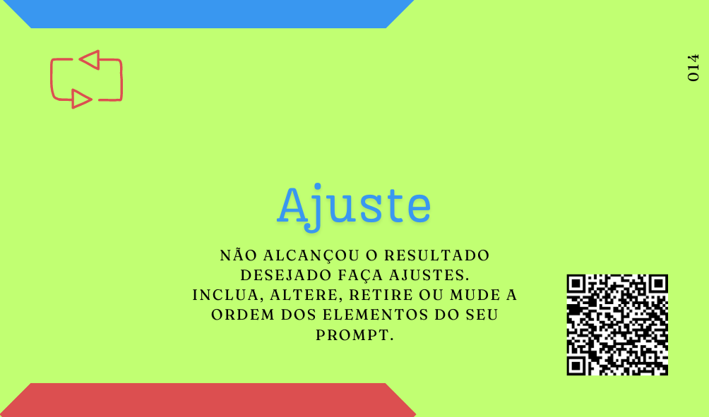
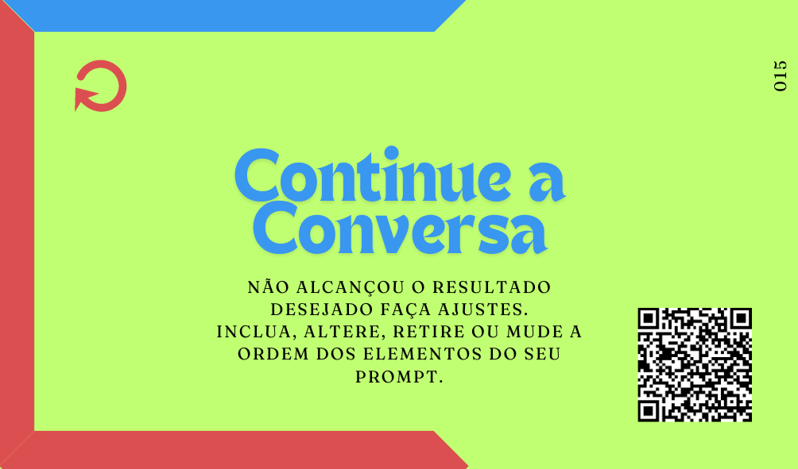
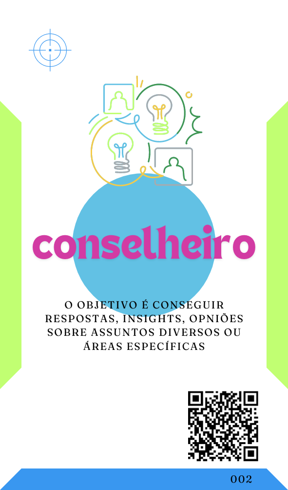
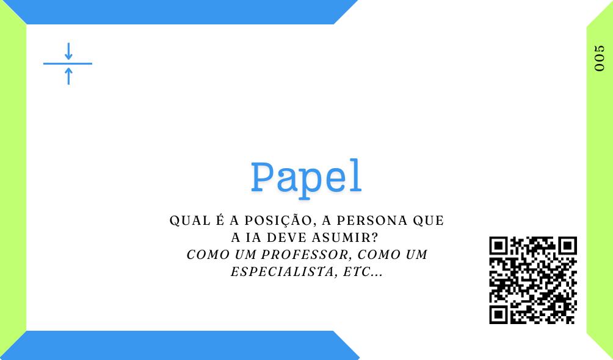
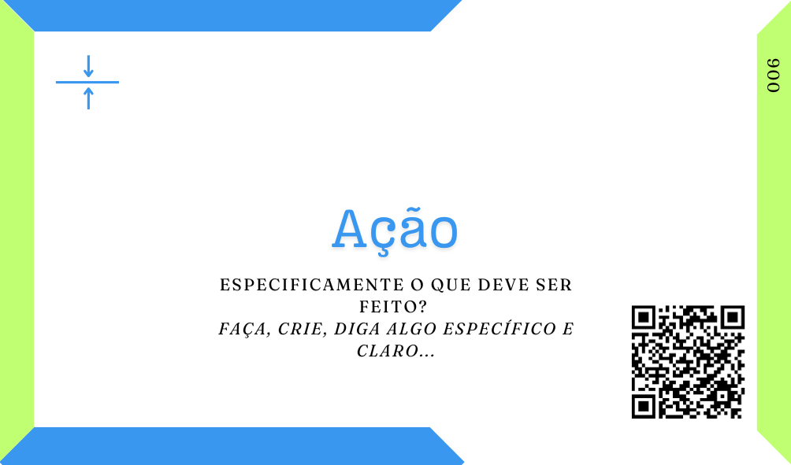
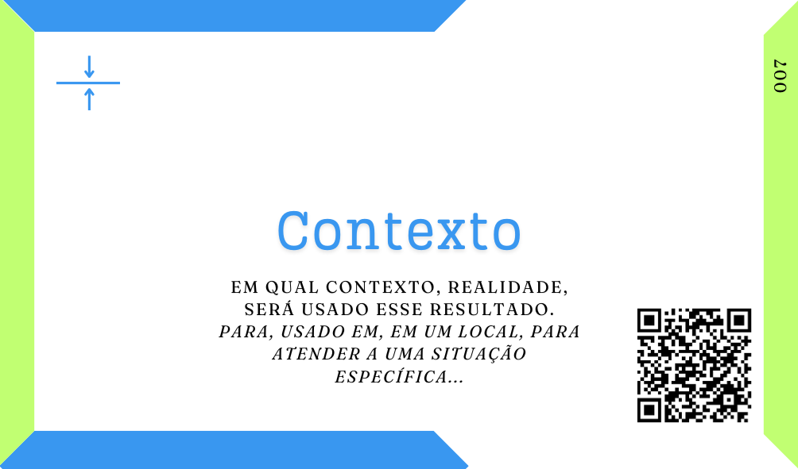
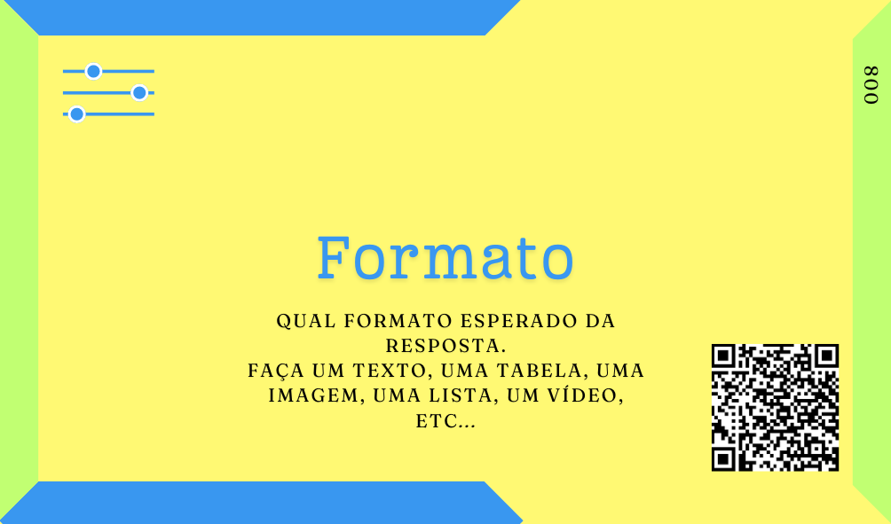
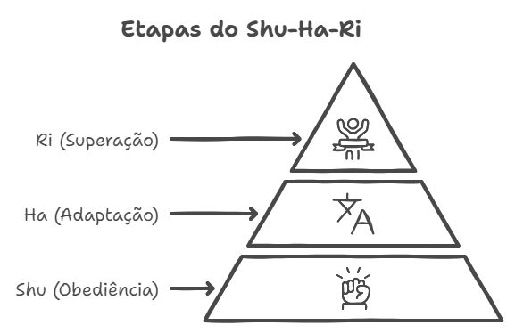
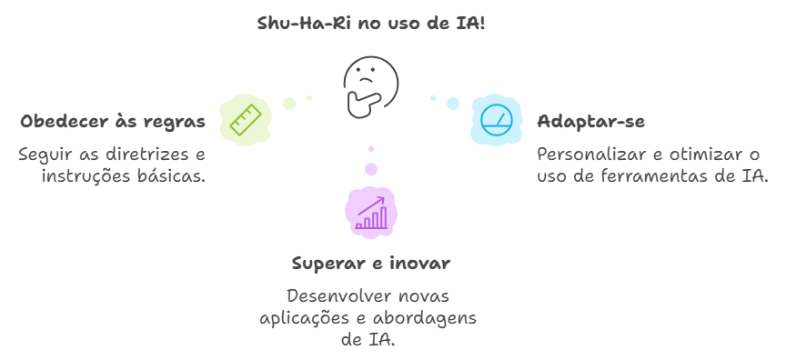

# Ajuste o proMpt ou Continue a conversa
***O que fazer depois que a primeira requisição já foi feita e tenho uma resposta?***

Temos duas possibilidades, a primeira mais pessimista acontecerá quando a resposta que o seu proMpt proporcionou não foi adequada, não atingiu as suas expectativas, nesse caso meu conselho é que você faça Ajuste em seu prompt.

Já, em outra possibilidade, onde o proMpt consegiu o resultado esperado, caso valha a pena e, principalmente, se tartar-se de um trabalho mais complexo e longo, então Continue a conversa para refinar ou aprofundar esse resultado.

  |   

## Ajuste
Esse Card é um lembrete de que esse é um trabalho evolucionário, caso em uma primeira requisição, em seu primeiro proMpt, você ainda não tenha alcançado o resultado desejado basta Ajustá-lo e repetir esse processo quantas vezes for necessário, contanto que tenhamos um bom custo benefício.

 Lembre-se, se solicitar para uma Inteligência Artificial (IA) a realização de uma atividade qualquer for mais demorado, custoso ou moroso do que realizar a atividade diretamente, vale reprensar o uso da IA aqui.

Mas, enquanto valer a pena, enquanto a IA fizer com que você economize o seu tempo, vale buscar os ajustes para alcançar o resultado desejado. Podemos observar alguns de nossos exemplos.

Uma forma de repensar um proMpt pode ser a inclusão de novos elementos. Em um proMpt inicial eu posso ter feito uma solicitação simples demais, como a seguinte:

```
Como um chefe de cozinha descreva para o cardápio o que é um Ovo pochê?
```

[](../tipos-de-prompt/conselheiro.md)

[](../partes-de-prompt/papel.md) **Chefe de cozinha**

[](../partes-de-prompt/acao.md) **descreva para o cardápio o que é um Ovo pochê**

Eu posso não gostar desse resultado e, neste caso, muito provavelmente isso acontece por eu não ter elaborado tão bem o meu proMpt.

```
Como um chefe de cozinha descreva o que é um Ovo pochê para um cardápio que será usado na inauguração de um restaurante de comida francesa e fusões modernas?
```

Ajustando-o eu poderia acrescentar mais Contexto, por exemplo.

### Ajuste 1
[](../tipos-de-prompt/conselheiro.md)

[](../partes-de-prompt/papel.md) **Chefe de cozinha**

[](../partes-de-prompt/acao.md) **descreva para o cardápio o que é um Ovo pochê**

 [](../partes-de-prompt/contexto.md) **um cardápio que será usado na inauguração de um restaurante de comida francesa e fusões modernas**

Então eu poderia continuar esse processo de Ajustes até alcançar ao resultado desejado. Poderia adicionar um formato e testar novamente, então adicionar um Exemplo e, talvez, finalmente ficar feliz com esse resultado.

```
Como um chefe de cozinha descreva o que é um Ovo pochê para um cardápio que será usado na inauguração de um restaurante de comida francesa e fusões modernas traga a resposta em um parágrafo único com os ingredientes listados no final?

Escreva seguindo o exemplo:
A feijoada é um prato típico da culinária brasileira que consiste num guisado de feijão preto com vários tipos de carne de porco e de boi. É servida com farofa, arroz branco, couve refogada e laranja fatiada.
Ingredientes principais:
* feijão-preto;
* paio;
* carne de porco
* carne de boi

```
### Ajuste 2
[](../tipos-de-prompt/conselheiro.md)

[](../partes-de-prompt/papel.md) **Chefe de cozinha**

[](../partes-de-prompt/acao.md) **descreva para o cardápio o que é um Ovo pochê**

 [](../partes-de-prompt/contexto.md) **um cardápio que será usado na inauguração de um restaurante de comida francesa e fusões modernas**

### Ajuste 3

[](../tipos-de-prompt/conselheiro.md)

[](../partes-de-prompt/papel.md) **Chefe de cozinha**

[](../partes-de-prompt/acao.md) **descreva para o cardápio o que é um Ovo pochê**

[](../partes-de-prompt/contexto.md) **um cardápio que será usado na inauguração de um restaurante de comida francesa e fusões modernas**

 [](../partes-de-prompt/controle/formato.md) **parágrafo único com os ingredientes listados no final**

### Ajuste 4

[](../tipos-de-prompt/conselheiro.md)

[](../partes-de-prompt/papel.md) **Chefe de cozinha**

[](../partes-de-prompt/acao.md) **descreva para o cardápio o que é um Ovo pochê**

[](../partes-de-prompt/contexto.md) **um cardápio que será usado na inauguração de um restaurante de comida francesa e fusões modernas**

[](../partes-de-prompt/controle/formato.md) **parágrafo único com os ingredientes listados no final**

 [](../partes-de-prompt/informacao/exemplos.md) **Exemplo da feijoada**

Essa é a forma mais obvia de ajustes a qual esses cards podem induzí-lo, porém você não precisa incluir algum elemento para fazer um ajuste, também pode retirar, inverter a ordem ou reescrever alguma parte, mudando qualquer um desses elementos, o limite é apenas a sua imaginação, por isso entendo que essa ferramenta deve facilitar a escrita de ["infinitos proMpts"](../um-mapa-para-infinitos-prompts.md) efetivamente.

## Continue a conversa
Outra possibilidade é que sua requisição tenha sido satisfatóriamente atendida, nesse caso, vale pesar se continuar essa conversa vale a pena.
 
- Mesmo satisfeito, eu preciso e/ou poderia me aprofundar mais nisso?
- Tem outos pontos relacionados ao mesmo problema que eu desejo e/ou necessito explorar?
- Continuar essa exploração vai economizar ou gastar o meu tempo?

Tem muito mais questões que pode se fazer para decidir se, mesmo satisfeito com o resultado, vale a pena continuar explorando aquela conversa com a IA.

No próprio prompt que acabamos de finalizar.

```
Como um chefe de cozinha descreva o que é um Ovo pochê para um cardápio que será usado na inauguração de um restaurante de comida francesa e fusões modernas traga a resposta em um parágrafo único com os ingredientes listados no final?

Escreva seguindo o exemplo:
A feijoada é um prato típico da culinária brasileira que consiste num guisado de feijão preto com vários tipos de carne de porco e de boi. É servida com farofa, arroz branco, couve refogada e laranja fatiada.
Ingredientes principais:
* feijão-preto;
* paio;
* carne de porco
* carne de boi

```

[](../tipos-de-prompt/conselheiro.md)

[](../partes-de-prompt/papel.md) **Chefe de cozinha**

[](../partes-de-prompt/acao.md) **descreva para o cardápio o que é um Ovo pochê**

[](../partes-de-prompt/contexto.md) **um cardápio que será usado na inauguração de um restaurante de comida francesa e fusões modernas**

[](../partes-de-prompt/controle/formato.md) **parágrafo único com os ingredientes listados no final**

[](../partes-de-prompt/informacao/exemplos.md) **Exemplo da feijoada**

 

Embora eu já esteja feliz com o resultado, eu poderia continuar essa conversa e explorar novas possibilidades. Em continuação eu escrevo um novo proMpt, inclusive mais simples, pois entendo que o Agente de IA (Agente) acumulará o aprendizado com o proMpt anterior.

```
Continuando, para o mesmo cardápio, quais seriam outros pratos que podem ser feitos com os mesmos ingredientes do ovo pochê, indique-os e já escreva suas descrições conforme o modelo anterior. Não repita nenhum prepado, preciso de pratos diferente usando os mesmos ingredientes base.
```
[](../tipos-de-prompt/conselheiro.md)

[](../partes-de-prompt/contexto.md) **para o mesmo cardápio**

[](../partes-de-prompt/acao.md) **indique novos pratos que possam ser feitos com os mesmos ingredientes.**

[](../partes-de-prompt/controle/limites.md) **sem repetir os preparos**

 

Essa conversa poderia ser levada a diante por muitas mensagens, lapidando ou aprofundando os resultados e um processo útil e único de melhoria continua.
## Aprenda com a IA enquanto ela aprende com você
Por isso eu insisto muito em indicar o uso intencional das IAs, com a popularização e facilitação de acesso as IAs Generativas (GenIas), por exemplo, eu entendo que essa é a grande oportunidade para aprendermos com elas, como elas já vem há muito tempo aprendendo conosco.

Sempre que você usa uma IA, intencionalmente ou não, ela está aprendendo. Então, pelo menos quando for intencional, façamos o mesmo.

Na minha percepção esse é um processo simples de melhoria contínua, uma busca por transcendência em nossas atividades, como no conceito Shu-Ha-Ri, em que buscamos em uma escalada superar a nossa competência atual, em busca de melhores resultados e práticas.

 Ha (Adaptação) -> Ri (Superação)" align="center">

Nesta etapa de uso da IA eu diria que estamos em algum lugar entre o Ha e o Ri, adaptando e buscanco a superação. O obejtivo desse material e todos os Decks aqui mostrados é, justamente, te ajudar a percorrer essas etapas de evolução no uso das GenIas, desde obedecer a alguns padrões para conseguir os primeiros resultados realmente produtivos, até superá-los e, se tudo correr bem, você nem precisar mais deste material de apoio.



O desejo enquanto escrevo este material é que todos possam inovar em suas vidas e profissões com um pouco do aprendizado que possam ter tido por aqui.

## Leia também
- ### [Tipos de proMpts e Agentes](tipos-de-prompt/README.md)
- ### [Um mapa para infinitos proMpts](um-mapa-para-infinitos-prompts.md)
  - #### [O Básico bem feito](prompt-basico.md)
  - #### [Completo ou complexo?](prompts-complexos.md) 

## Relações
<table>
<tr>
  <th>Componente</th>	<th>Método</th>	<th>Descrição</th>
</tr>
<tr>
  <td>Ha</td><td>Shu-Ha-Ri</td><td>	Romper/Modificar, explorar e modificar as regras que aprendeu.</td>
</tr>
  <tr>
  <td>Ri</td><td>Shu-Ha-Ri</td><td>	Separar/Superar, pode criar suas próprias abordagens.</td>
</tr>
<tr>
  <td>Options</td><td>GROW</td><td> Exploração de alternativas para alcançar as metas.</td>
</tr>  
<tr>
  <td>WILL</td><td>GROW</td><td> Compromisso com o plano de ação.</td>
</tr>  
</table>

## Referências
PERPLEXITY. SHU-HA-RI. Perplexity, 2024. Disponível em: https://www.perplexity.ai/search/shu-ha-ri-rIusHjlWRGiYJGALhZqGTg. Acesso em: 11 set

PERPLEXITY. GROW é um acrônimo para GOAL? Disponível em: https://www.perplexity.ai/search/grow-e-um-acronimo-para-goal-m-0Fvr6CKGRBOUOlngLHzf6g. Acesso em: 12 out. 2023.
