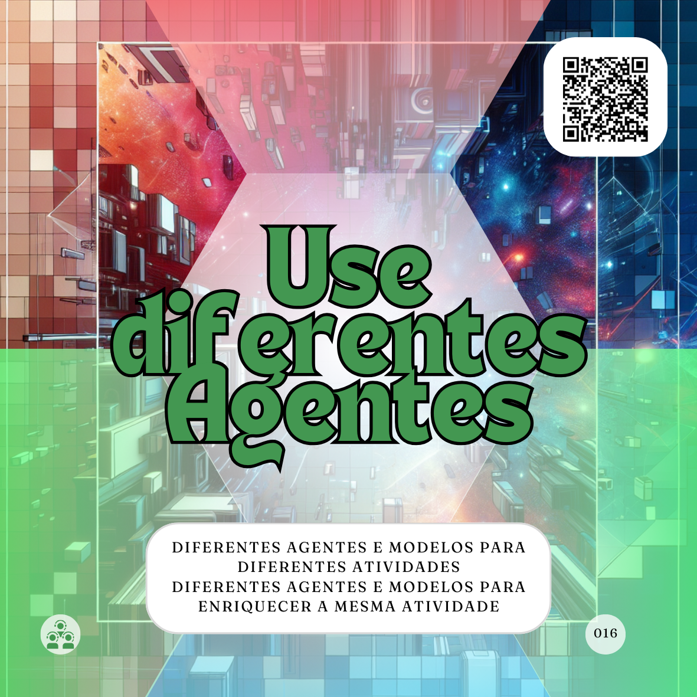

# Use diferentes Agentes
***O uso de diferentes Agentes de Inteligência Artificial (Agentes) ou de diferentes Modelos de Inteligência Artificial (Modelos) deve enriquecer a sua construção dialogica com essa tecnologia***

Mesmo supondo que você chegou a um resultado satisfatório, já explorou alguns proMpts diferentes ajustando e continucando com suas conversas, se você está usando apenas um Agente é provavel que ainda possa explorar ainda mais as capacidades da Inteligência Artificial (IA).

Agentes são aquelas entidades autonômas que aplicam Modelos para interagir com ao ambiente. Por exemplo, o ChatGPT, desenvolvido pela OpenAI, é um Agente que utiliza o Modelo GPT (Generative Pre-trained), na versão GPT-4 enquanto escrevo este, para gerar suas respostas aos sinais captados do ambiente.

Outro exemplo são o Gemini, o Gemini Advanced e o Google AI Studio, são três Agentes diferentes, que integarem de formas diferentes com o ambiente e acessam recursos diferentes do Modelo Gemini.

Ou seja, enquanto o Agente é a interface com o ambiente (ou usuário) o Modelo é o conjunto de regras e cálculos que gera as respostas para esse agente.

Sabendo disso pode ser fácil pensar que ao usar diferentes Agentes podemos ter resultados diferentes e o mesmo para Modelos, ou ainda mais. Usar essa característica para potencializar os resultados que você precisa pode ser considerado uma boa, e comum, prática de uso de IAs. Talvez pouco divulgada, pois não é interessante para uma fornecedora de software, a fornecedora da IA, ficar te estimulando a usar os concorrente.

De qualquer forma, temos inumeros tipos de Agentes, que consolidamos nos tês tipos básicos ([Tarefeiro](../tipos-de-prompt/tarefeiro.md), [Conselheiro](../tipos-de-prompt/conselheiro.md) e [Criativo](../tipos-de-prompt/criativo.md)), e algums Modelos disponíveis no mercado, alguns para usos específicos (como criação de imagens, por exemplo).

Seria um disperdívio desconsiderarmos o potencial disso no nosso uso intencional diário de IAs.

Aqui eu vejo dois caminhos. Eu posso usar Agentes diferentes para funções diferentes. 

Eu, por exemplo, tenho meus agentes de mercado favoritos, o ChatGPT para atividades gerais, como ([Tarefeiro](../tipos-de-prompt/tarefeiro.md) ou [Conselheiro](../tipos-de-prompt/conselheiro.md), o nightcafe.studio e o leonardo.ai como [Criativos](../tipos-de-prompt/criativo.md) para imagens, o perplexity.ai como [Tarefeiro](../tipos-de-prompt/tarefeiro.md) para pesquisas e o, mais recente amigo, napkin.ai como  [Criativos](../tipos-de-prompt/criativo.md) para formatação de documentos e facilitação gráfica.

Aqui eu listei vários Agentes que usam ou não (eu não sei) diferentes Modelos com foco em soluções de problemas específicos, desde pesquisas na Web até a criação de documentos ou imagens. Assim, perceba que não é necessário usar apenas um Agente, você pode distribuir o trabalho entre vários deles, formando assim diversas parcerias digitais.

Alias, uma prática que tenho e recomendo é sempre que puder testar novos Agente de IA, minha última ba descoberta foi o napkin.ai, que é um recurso genial para facilitar a facilitação gráfica de conceitos.

O segundo caminho é unir vários Agentes com um único propósito, ou seja, colocar suas IAs para conversar entre elas. 

No meu caso, para atividades mais específicas, eu uso quatro Agentes, o proprio ChatGPT como um Agente Genérico, um agente configurado para agir como uma Assistente para mim e os estudantes em minhas aulas de universidade, um agente configurado para agir como um especialista em Marketing Digital e o [OratórIAfma](http://bit.ly/oratoriafma) configurado para atender e apoiar as pessoas que tem contato com meus materiais sobre IA. 

Esses quatro agentes, embora com configurações diferentes, usam o Modelo GPT.

Por exemplo, quando quero preparar uma digulgação sobre IAs, um evento ou novo material, eu aciono o ChatGPT, o [OratórIAfma](http://bit.ly/oratoriafma) e o meu especialísta em Marketing, muitas vezes, usando o mesmo proMpt nos três para fazer um cruzamento das informações recebidas, alias, muitas vezes, esse cruzamento eu também peço que eles mesmos façam.

Dessa forma eu potencilizo as minhas ações, consigo diversas opniões diferentes, mesmo que do ponto de vista humano, às vezes, eu esteja trabalhando sosinho.

Aqui é importante lembrar que as IAs não são factuais, por isso, como humano na equação, sempre cabe a mim validar e fazer a curadoria daquilo que é gerado por elas.

## Relações
<table>
<tr>
  <th>Componente</th>	<th>Método</th>	<th>Descrição</th>
</tr>
<tr>
  <td>Ha</td><td>Shu-Ha-Ri</td><td>	Romper/Modificar, explorar e modificar as regras que aprendeu.</td>
</tr>
<tr>
  <td>Options</td><td>GROW</td><td> Exploração de alternativas para alcançar as metas.</td>
</tr>  
<tr>
  <td>WILL</td><td>GROW</td><td> Compromisso com o plano de ação.</td>
</tr>  
</table>

## Referências
PERPLEXITY. Diferencie Modelos de Agentes. Perplexity AI, 2024. Disponível em: https://www.perplexity.ai/search/diferencie-modelos-de-agentes-6rwdS4HtTdKDRleW3fNfAA. Acesso em: 12 set. 2024.

PERPLEXITY. SHU-HA-RI. Perplexity, 2024. Disponível em: https://www.perplexity.ai/search/shu-ha-ri-rIusHjlWRGiYJGALhZqGTg. Acesso em: 11 set

PERPLEXITY. GROW é um acrônimo para GOAL? Disponível em: https://www.perplexity.ai/search/grow-e-um-acronimo-para-goal-m-0Fvr6CKGRBOUOlngLHzf6g. Acesso em: 12 out. 2023.
