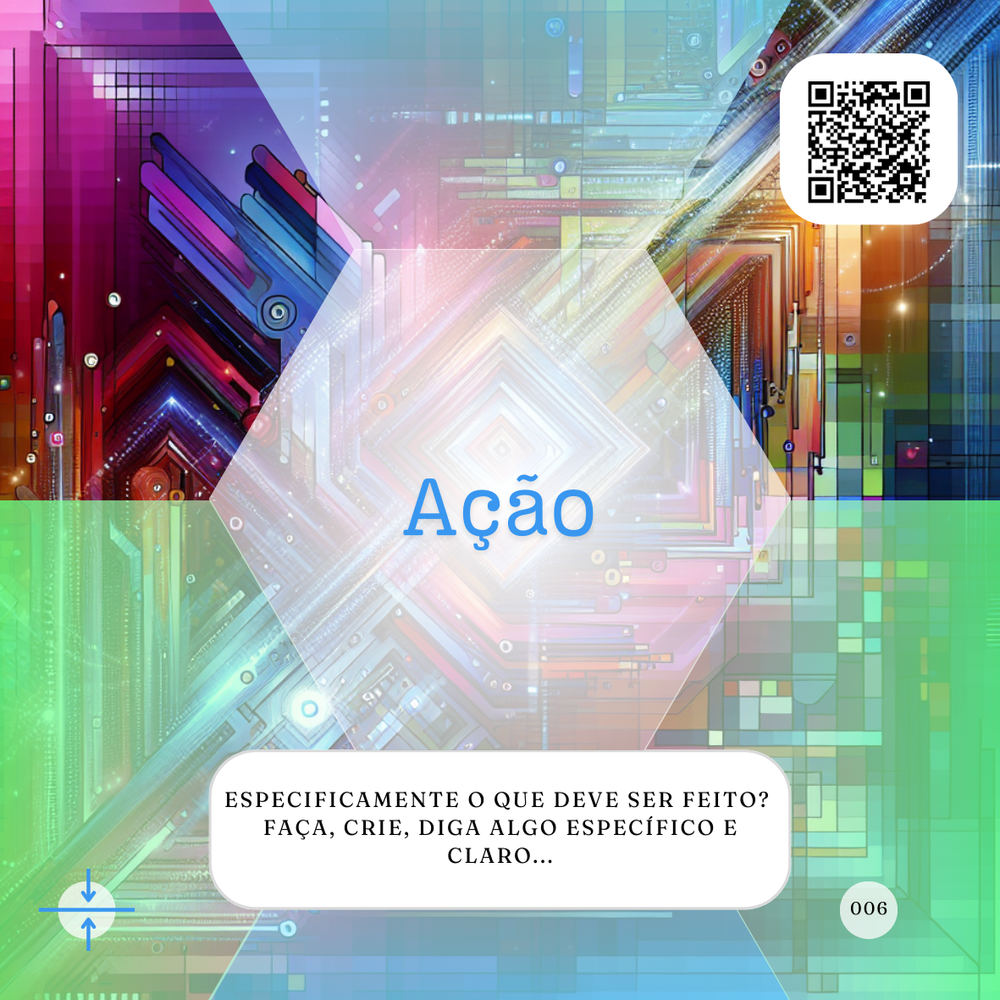

# Equipamento

***A Inteligência Artificial (IA) deve usar, ou simular o uso, de um equipamento específico para sua criação.***


Praticamente uma exclusividade de proMpts criativos, para a maioria dos Agentes de IA (Agentes)  populares uma exclusividade da criação de imagens, esse elemento é proposto por Linus Ekenstam no "Dynamic Prompting", onde ele indica a importância de definir um "Photographic Equipment" para que a IA crie uma imagem com o resultado desejado.

A intenção aqui é buscar um melhor resultado principalmente na criação de imagens mais realistas. Por exemplo, eu posso simplesmente pedir a criação de uma imagem como no proMpt abaixo:

```
Crie a imagem com uma porporção de 16x9 de um empresário com um deck do card game de "proMpto" nas mãos e atrás dele temos mais três agentes de inteligência artificial o foco da imagem deve ser o verso do Caminho para  Cards com o logo "proMpto".
```

Esse já é um proMpt criativo bem estruturado, trazendo claramente a Ação, o Formato e o Assunto, mas vamos altera-lo um pouco.

```
Crie uma foto no tamanho 54x86mm de um empresário com um deck do card game de "proMpto" nas mãos e atrás dele temos mais três agentes de inteligência artificial o foco principal da foto deve ser o verso do Caminho para  Cards com o logo "proMpto" e a camera usada é uma Câmera Instantânea com uma lente grande angular.
```
Aqui temos uma estrutura mais específica que pode impactar bastante no resultado final.

[](../../tipos-de-prompt/criativo.md)

[](../../partes-de-prompt/acao.md) **Crie uma foto** 

[](../../partes-de-prompt/controle/formato.md) **uma foto no tamanho 54x86mm**

[](../../partes-de-prompt/criacao/assunto.md) **um empresário com um deck do card game de "proMpto" nas mãos e atrás dele temos mais três agentes de inteligência artificial o foco principal da foto deve ser o verso do Caminho para  Cards com o logo "proMpto"**

[](../../partes-de-prompt/criacao/equipamento.md) **camera usada é uma Câmera Instantânea com uma lente grande angular**

Como você pode testar nos dois exemplos acima, adicionar o equipamento ao pedido de criação de imagem pode ter um impacto significativo no resultado entregue por essa. Mas vamos tentar algo diferente do que imagens, por exemplo no seguinte proMpt:

```
Escreva um versinho sobre inteligência artificial.
```

Nós temos uma Ação e Assunto definidos nesse pedido, e ela não tem relação com imagens, mas o que acontece se eu pedir para esse verso ser escrito com um Equipamento específico?

```
Escreva um versinho sobre inteligência artificial e mostre esse verso como se fosse escrito com uma maquina de escrever antiga.
```

Aqui adicionamos apenas o equipamento e, sim, teremos um resultado diferente. 

[](../../tipos-de-prompt/criativo.md)

[](../../partes-de-prompt/acao.md) **Escreva um versinho** 

[](../../partes-de-prompt/criacao/assunto.md) **sobre inteligência artificial**

[](../../partes-de-prompt/criacao/equipamento.md) **mostre esse verso como se fosse escrito com uma maquina de escrever antiga**

Aqui estamos lapidando a forma como a IA deve apresentar o resultado que lhe foi solicitado, por isso é um componente mais comum, ou alinhado com, proMpts criativos.

Lembre-se que caso a criação solicitada seja informativa, cabe a você, como o humano nessa parceria, verificar a vericidade das informações, uma vez que as IAs não são factuais.

## Relações
<table>
<tr>
  <th>Componente</th>	<th>Método</th>	<th>Descrição</th>
</tr>
<tr>
  <td>Photographic Equipment</td><td>Dynamic Prompting</td><td>	Controlar a qualidade do resultado.</td>
</tr>
<tr>
  <td>&lt;figure&gt;</td><td>HTML5</td><td>	usado para anotar ilustrações, diagramas, fotos, listagens de códigos, etc.</td>
</tr>  
</table>

## Referências
WORLD WIDE WEB CONSORTIUM (W3C). HTML5: Edition for Web Authors. The figure element. 09 ago. 2011. Disponível em: https://www.w3.org/TR/2011/WD-html5-author-20110809/the-figure-element.html. Acesso em: 04 set. 2024.

EKENSTAM, Linus. @LinusEkenstam. Twitter. Disponível em: https://twitter.com/LinusEkenstam. Acesso em: 04 set. 2024.


<hr><p xmlns:cc="http://creativecommons.org/ns#" xmlns:dct="http://purl.org/dc/terms/"><a property="dct:title" rel="cc:attributionURL" href="https://davifma.github.io/proMpto/">prompto.github.io</a> by <a rel="cc:attributionURL dct:creator" property="cc:attributionName" href="http://linkedin.com/in/davifma">Davi Fontebasso Marques de Almeida</a> is licensed under <a href="https://creativecommons.org/licenses/by/4.0/?ref=chooser-v1" target="_blank" rel="license noopener noreferrer" style="display:inline-block;">Creative Commons Attribution 4.0 International </a></p>
