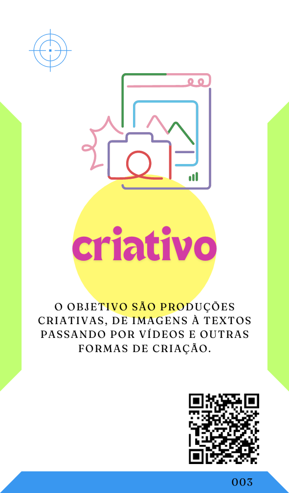
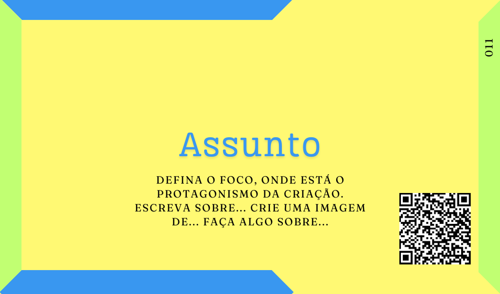

# Equipamento

***A Inteligência Artificial (IA) deve usar, ou simular o uso, de um equipamento específico para sua criação.***

[](../../partes-de-prompt/equipamento.md)

Praticamente uma exclusividade de proMpts criativos, para a maioria dos Agentes de IA (Agentes)  populares uma exclusividade da criação de imagens, esse elemento é proposto por Linus Ekenstam no "Dynamic Prompting", onde ele indica a importância de definir um "Photographic Equipment" para que a IA crie uma imagem com o resultado desejado.

A intenção aqui é buscar um melhor resultado principalmente na criação de imagens mais realistas. Por exemplo, eu posso simplesmente pedir a criação de uma imagem como no proMpt abaixo:

```
Crie a imagem com uma porporção de 16x9 de um empresário com um deck do card game de "proMpto" nas mãos e atrás dele temos mais três agentes de inteligência artificial o foco da imagem deve ser o verso do Deck de Cards com o logo "proMpto".
```

Esse já é um proMpt criativo bem estruturado, trazendo claramente a Ação, o Formato e o Assunto, mas vamos altera-lo um pouco.

```
Crie uma foto no tamanho 54x86mm de um empresário com um deck do card game de "proMpto" nas mãos e atrás dele temos mais três agentes de inteligência artificial o foco principal da foto deve ser o verso do Deck de Cards com o logo "proMpto" e a camera usada é uma Câmera Instantânea com uma lente grande angular.
```
Aqui temos uma estrutura mais específica que pode impactar bastante no resultado final.

[](../../tipos-de-prompt/criativo.md)

[](../../partes-de-prompt/acao.md) **Crie uma foto** 

[](../../partes-de-prompt/controle/formato.md) **uma foto no tamanho 54x86mm**

[](../../partes-de-prompt/assunto.md) **um empresário com um deck do card game de "proMpto" nas mãos e atrás dele temos mais três agentes de inteligência artificial o foco principal da foto deve ser o verso do Deck de Cards com o logo "proMpto"**

[](../../partes-de-prompt/equipamento.md) **camera usada é uma Câmera Instantânea com uma lente grande angular**


