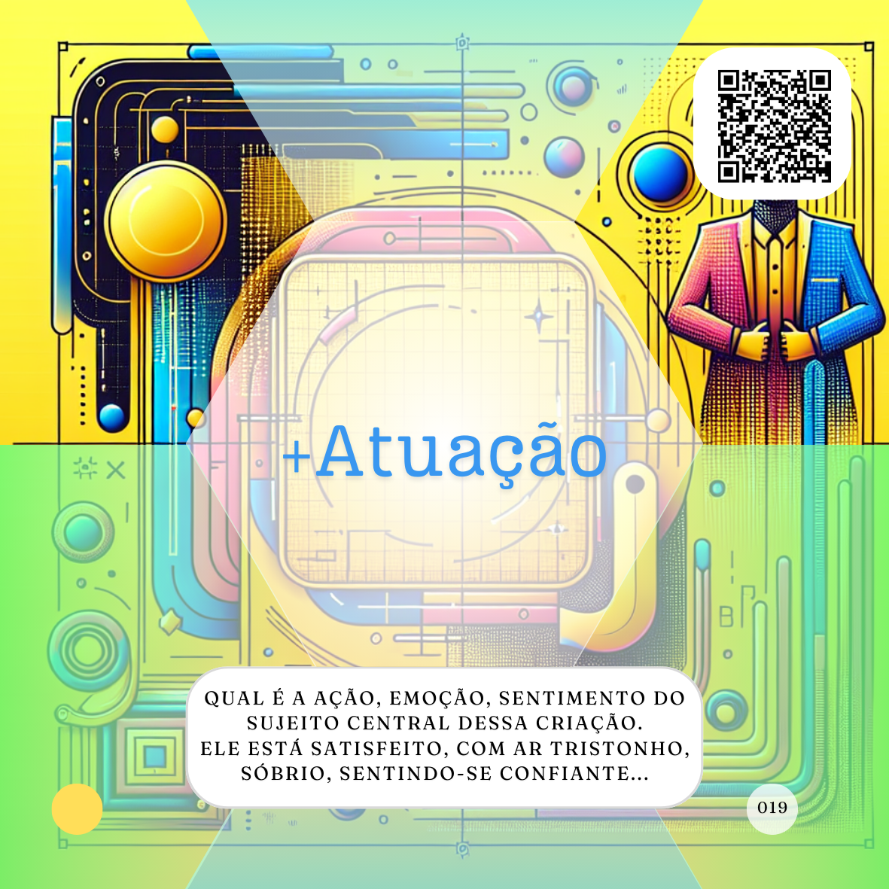

# Estilo
*(Criação)*

***Qual será o estilo usado pela Inteligência Artificial (IA) para realizar a criação?***


Este elemento também é uma proposta do Linus Ekenstam, no Dynamic, para aperfeiçoar a criação de imagens utilizando IAs. A ideia novamente é, tendo um propósito claro, ser o mais específico possível informando qual deve ser o Estilo da criação, isso foi pensado para imagens, estilo renascentista, estilo cubista e etc, toda via, qualquer obra criativa carraga as marcas do seu estilo que estão relacionados a epoca, contexto e localização de onde foram feitas, nenhuma criação humana nasce no vácuo, repetia sempre um colega de clube do livro.

Então, novamente considerando as figuras de linguagem em geral como figuras, formas de imaginetizar um conceito, uma mensagem ou algo semelhante, podemos aplicar o conceito de Estilo para qualquer criação que uma IA for realizar, tornando mais específico nosso pedido, o que deve garantir um resultado mais adequado.

Sempre que falarmos de criações, começamos com os exemplos mais classicos, conhecidos e usados em termos de IA, as imagens.

```
Crie uma foto de um empresário com um deck do card game de "proMpto" nas mãos e atrás dele temos mais três agentes de inteligência artificial o empresario está satisfeito e confiante demonstrando controle sob os agentes que o acompanham, eles estão no alto do Corcovado no Rio de Janeiro, em 2024 às 00:01 do dia 1 de janeiro o foco principal da foto deve ser o verso do Deck com o logo "proMpto". A foto deve ter no tamanho 54x86mm. A camera usada é uma Câmera Instantânea com uma lente grande angular.
```

Então vamos adicionar a informação de Estilo ao proMpt acima. Caso você não tenha seu Agente de IA (Agente) criativo preferido pode usar o [OratorIA FMA](http://bit.ly/oratoriafma) para a criação de suas imagens e textos também. Como no novo prompt proposta abaixo.

```
Crie uma imagem de um empresário com um deck do card game de "proMpto" nas mãos e atrás dele temos mais três agentes de inteligência artificial o empresario está satisfeito e confiante demonstrando controle sob os agentes que o acompanham, use um estilo retrofuturista, eles estão no alto do Corcovado no Rio de Janeiro, em 2024 às 00:01 do dia 1 de janeiro o foco principal da foto deve ser o verso do Deck com o logo "proMpto". A foto deve ter no tamanho 54x86mm. A camera usada é uma Câmera Instantânea com uma lente grande angular.
```

[](../../tipos-de-prompt/criativo.md)

[](../../partes-de-prompt/acao.md) **Crie uma foto de um empresário com um deck do card game de "proMpto" nas mãos e atrás dele temos mais três agentes de inteligência artificial**

[](../../partes-de-prompt/criacao/assunto.md)[](../../partes-de-prompt/criacao/mais-atuacao.md) o empresario está satisfeito e confiante demonstrando controle sob os agentes de inteligência artificial que o acompanham, ***use um estilo retrofuturista***

[](../../partes-de-prompt/contexto.md)[](../../partes-de-prompt/criacao/mais-lugar.md)[](../../partes-de-prompt/criacao/mais-hora.md) **eles estão no alto do Corcovado no Rio de Janeiro, em 2024 às 00:01 do dia 1 de janeiro o foco principal da foto deve ser o verso do Deck com o logo "proMpto"**

[](../../partes-de-prompt/controle/formato.md) **A foto deve ter no tamanho 54x86mm.**

[](../../partes-de-prompt/criacao/equipamento.md) **A camera usada é uma Câmera Instantânea com uma lente grande angular.**


Se você testar os dois proMpts acima, cujo a única diferença é a inclusão do Estilo, verá o impacto que este passo simples terá nas suas criações.

Esse experimento é uma boa ilustração, com o perdão do trocadilho.

O estilo não precisa se resumir apenas a isso, ele pode e deve trazer informações sobre o sugeito principal da criação, se for uma pessoa por exemplo, como ela é? Que roupas usa? Cor de cabelo? Tipo de corpo e etc.

Agora vamos fazer um teste com um texto.

```
Escreva um versinho sobre inteligência artificial,com um estilo satírico, e mostre esse verso como se fosse escrito com uma maquina de escrever antiga em Minas Gerais.
```

[](../../tipos-de-prompt/criativo.md)

[](../../partes-de-prompt/acao.md) **Escreva um versinho** 

[](../../partes-de-prompt/criacao/assunto.md) sobre inteligência artificial, ***com um estilo satírico***

[](../../partes-de-prompt/criacao/equipamento.md) **mostre esse verso como se fosse escrito com uma maquina de escrever antiga**

 **a inclusão de um estado brasileiro**

Mude esse Estilo satírico para romântico por exemplo e veja a mudança.

Por fim, vamos testar como isso poderia impactar em uma música.

```
Faça uma balada sobre inteligência artificial como se fosse gravada em um disco de vinil por um interprete de Minas Gerais às 15:00 horas em uma tarde preguiçosa, ele tristonho e saudoso, em estilo Rock Pop.
```

[](../../tipos-de-prompt/criativo.md)

[](../../partes-de-prompt/acao.md) **Faça uma balada sobre inteligência artificial**

[](../../partes-de-prompt/criacao/equipamento.md) **se fosse gravada em um disco de vinil**

[](../../partes-de-prompt/contexto.md)[](../../partes-de-prompt/criacao/mais-lugar.md)[](../../partes-de-prompt/criacao/mais-hora.md) **por um interprete de Minas Gerais às 15:00 horas em uma tarde preguiçosa**

[](../../partes-de-prompt/criacao/assunto.md)[]](../../partes-de-prompt/criacao/mais-atuacao.md) ele tristonho e saudoso, ***em estilo Rock Pop***.

[Clique aqui para ver o resultado.](https://suno.com/song/4f03743b-906e-44a4-a1bd-77b8a88c5404)

É certo, que se trocarmos o estilo de Rock Pop para qualquer outro teremos no mínimo uma melodia diferente.

Definir um estilo para suas criações ajudará a IA a te trazer um resultado mais adequado as suas expectativas, porém isso ainda não o abstem do seu papel de curadoria e responsável por ser o humano nessa equação. Lembre-se que em todas as criações por IA vale a verificação dos direitos autorais.

## Relações
<table>
<tr>
  <th>Componente</th>	<th>Método</th>	<th>Descrição</th>
</tr>
<tr>
  <td>Style</td><td>Dynamic Prompting</td><td>	Caracteristicas do foco da criação.</td>
</tr>
<tr>
  <td>&lt;figure&gt;</td><td>HTML5</td><td>	usado para anotar ilustrações, diagramas, fotos, listagens de códigos, etc.</td>
</tr>  
</table>

## Referências
WORLD WIDE WEB CONSORTIUM (W3C). HTML5: Edition for Web Authors. The figure element. 09 ago. 2011. Disponível em: https://www.w3.org/TR/2011/WD-html5-author-20110809/the-figure-element.html. Acesso em: 04 set. 2024.

EKENSTAM, Linus. @LinusEkenstam. Twitter. Disponível em: https://twitter.com/LinusEkenstam. Acesso em: 04 set. 2024.

MIDLIBRARY. Disponível em: https://midlibrary.io/styles. Acesso em: 20 out. 2024.


<hr><p xmlns:cc="http://creativecommons.org/ns#" xmlns:dct="http://purl.org/dc/terms/"><a property="dct:title" rel="cc:attributionURL" href="https://davifma.github.io/proMpto/">prompto.github.io</a> by <a rel="cc:attributionURL dct:creator" property="cc:attributionName" href="http://linkedin.com/in/davifma">Davi Fontebasso Marques de Almeida</a> is licensed under <a href="https://creativecommons.org/licenses/by/4.0/?ref=chooser-v1" target="_blank" rel="license noopener noreferrer" style="display:inline-block;">Creative Commons Attribution 4.0 International </a></p>
