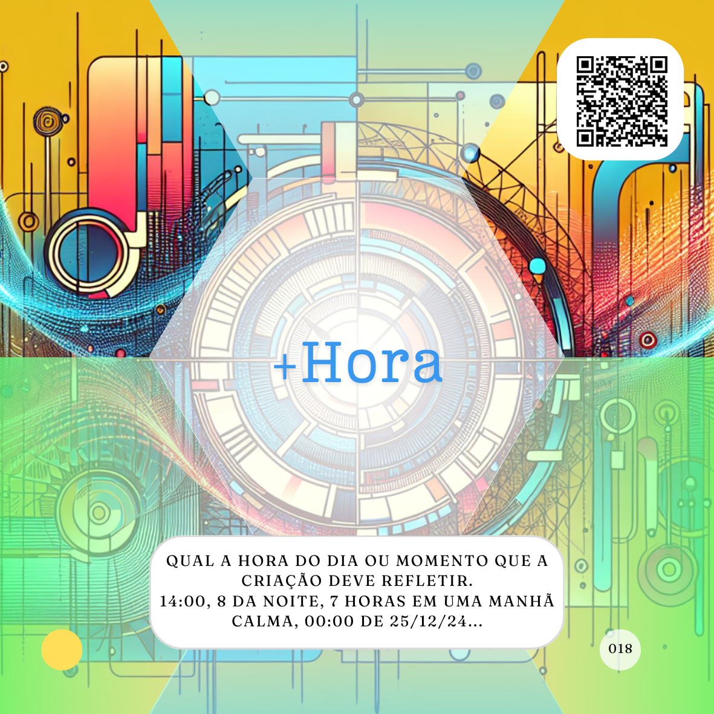

# Hora
*(Criação)*

***Qual é a hora do dia, ou o momento, que a criação feita pela Inteligência Artifícial (IA) deve refletir***



Também proposto como parte do Dynamic Prompting, por Linus Ekenstam, para aprimorar criação de imagens mais realistas. Aqui, além de ser exatamente o que parece, como dizer a hora do dia em que a imagem está sendo produzida, o objetivo oculto é definir qual a iluminação para essa imagem.

Acredito que este seja mesmo um passo, ou atributo, muito mais relevante e efetivo para criação de imagens especificamente, todavia, pensando na simulação do comportamento de pessoas criativas por uma IA isso também pode ser uma informação importante. Poetas devem escrever de forma diferente pela manhã ou pela noite, por exemplo.

Pensando no caso mais óbvio, podemos fazer um teste com o seguinte proMpt:

```
Crie uma foto no tamanho 54x86mm de um empresário com um deck do card game de "proMpto" nas mãos e atrás dele temos mais três agentes de inteligência artificial o foco principal da foto deve ser o verso do Caminho para Cards com o logo "proMpto" e a camera usada é uma Câmera Instantânea com uma lente grande angular. Eles estão no alto do Corcovado no Rio de Janeiro, em 2024.
```

Primeiro vamos simplesmente acrescer uma hora específica. 

```
Crie uma foto no tamanho 54x86mm de um empresário com um deck do card game de "proMpto" nas mãos e atrás dele temos mais três agentes de inteligência artificial o foco principal da foto deve ser o verso do Caminho para Cards com o logo "proMpto" e a camera usada é uma Câmera Instantânea com uma lente grande angular. Eles estão no alto do Corcovado no Rio de Janeiro, em 2024 às 00:01 do dia 1 de janeiro.
```


Nesse caso usamos literalmente uma hora exata.

Nesse caso temos um proMpt bastante interessante e complexo.

[](../../tipos-de-prompt/criativo.md)

[](../../partes-de-prompt/acao.md) **Crie uma foto** 

[](../../partes-de-prompt/controle/formato.md) **uma foto no tamanho 54x86mm**

[](../../partes-de-prompt/criacao/assunto.md) **um empresário com um deck do card game de "proMpto" nas mãos e atrás dele temos mais três agentes de inteligência artificial o foco principal da foto deve ser o verso do Caminho para  Cards com o logo "proMpto"**

[](../../partes-de-prompt/criacao/equipamento.md) **camera usada é uma Câmera Instantânea com uma lente grande angular**

**no alto do Corcovado no Rio de Janeiro4**

**em 2024 às 00:01 do dia 1 de janeiro**

Agora, e se tentassemos algo mais como um momento?

```
Crie uma foto no tamanho 54x86mm de um empresário com um deck do card game de "proMpto" nas mãos e atrás dele temos mais três agentes de inteligência artificial o foco principal da foto deve ser o verso do Caminho para Cards com o logo "proMpto" e a camera usada é uma Câmera Instantânea com uma lente grande angular. Eles estão no alto do Corcovado no Rio de Janeiro, às 15:00 horas em uma tarde preguiçosa.
```


Embora pareça que alteramos apenas o horário, mas na verdade também alteramos sua intenção, aqui devemos ter algo além de um simples ajuste de luz.

[](../../tipos-de-prompt/criativo.md)

[](../../partes-de-prompt/acao.md) **Crie uma foto** 

[](../../partes-de-prompt/controle/formato.md) **uma foto no tamanho 54x86mm**

[](../../partes-de-prompt/criacao/assunto.md) **um empresário com um deck do card game de "proMpto" nas mãos e atrás dele temos mais três agentes de inteligência artificial o foco principal da foto deve ser o verso do Caminho para  Cards com o logo "proMpto"**

[](../../partes-de-prompt/criacao/equipamento.md) **camera usada é uma Câmera Instantânea com uma lente grande angular**

**no alto do Corcovado no Rio de Janeiro**

**às 15:00 horas em uma tarde preguiçosa.**

Vale lembrar o conceito que venho trazendo de figura, como a figura de linguagem que deseja espressar algo, não necessáriamente na forma de imagens. Uma ilustração, no sentido de ilustrar algo, não está restrita as artes visuais.

Um som, também é uma ótima figura de expressão. E se eu pedisse que uma IA criasse uma cantiga?

```
Faça uma cantiga sobre inteligência artificial como se fosse gravada em um disco de vinil por um compositor de Minas Gerais às 15:00 horas em uma tarde preguiçosa.
```
(https://suno.com/song/6b02d014-7111-40b3-9e00-d01276567216)[Toque a música aqui]
## Relações
<table>
<tr>
  <th>Componente</th>	<th>Método</th>	<th>Descrição</th>
</tr>
<tr>
  <td>Place</td><td>Dynamic Prompting</td><td>	Localização da imagem, ano ou época.</td>
</tr>
<tr>
  <td>&lt;figure&gt;</td><td>HTML5</td><td>	usado para anotar ilustrações, diagramas, fotos, listagens de códigos, etc.</td>
</tr>  
</table>

## Referências
WORLD WIDE WEB CONSORTIUM (W3C). HTML5: Edition for Web Authors. The figure element. 09 ago. 2011. Disponível em: https://www.w3.org/TR/2011/WD-html5-author-20110809/the-figure-element.html. Acesso em: 04 set. 2024.

EKENSTAM, Linus. @LinusEkenstam. Twitter. Disponível em: https://twitter.com/LinusEkenstam. Acesso em: 04 set. 2024.


<hr><p xmlns:cc="http://creativecommons.org/ns#" xmlns:dct="http://purl.org/dc/terms/"><a property="dct:title" rel="cc:attributionURL" href="https://davifma.github.io/proMpto/">prompto.github.io</a> by <a rel="cc:attributionURL dct:creator" property="cc:attributionName" href="http://linkedin.com/in/davifma">Davi Fontebasso Marques de Almeida</a> is licensed under <a href="https://creativecommons.org/licenses/by/4.0/?ref=chooser-v1" target="_blank" rel="license noopener noreferrer" style="display:inline-block;">Creative Commons Attribution 4.0 International </a></p>
