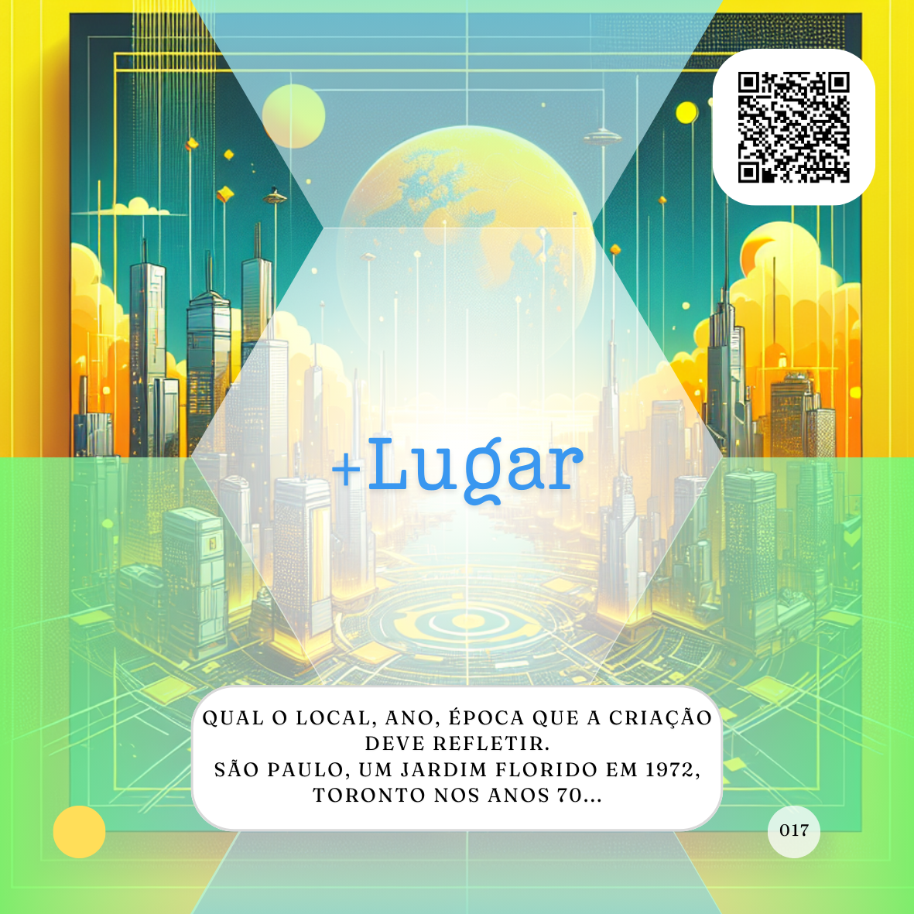

# Lugar
*(Criação)*

***Qual o local, ano ou era que a criação deveria refletir.***



Proposto como parte do Dynamic Prompting, por Linus Ekenstam, para aprimorar criação de imagens mais realistas. A ideia básica é que para criar uma boa imagem é necessária uma boa descrição do local que aquela imagem deve representar, o que pode incluir uma era ou um ano. Um bar de rock na Londres dos anos 70, certamente é diferente de um bar de rock na Amsterdã de 2000.

Na minha concepção de "Figura" como uma ilustração de algo, não necessariamente com uma imagem, conceito apoiado pelo HTML 5 por exemplo, fica clara a utilidade dessa informação para qualquer criação que pretende ilustrar algo, independente de seu formato.

Novamente, uma poesia escrita por alguém em Londres nos anos 70 possívelmente seria bem diferente de uma escrita por alguém em Amsterdã nos anos 2000, mesmo que tivessem a mesma temática. Ou mesmo a explicação de algum fato, muda de acordo com o lugar (no tempo e espaço) em que ela acontece. Assim, o Lugar, é uma definição importante e poderosa, ainda mais ao falarmos sobre criações.

Vamos pensar nesse exemplo:

```
Crie uma foto no tamanho 54x86mm de um empresário com um deck do card game de "proMpto" nas mãos e atrás dele temos mais três agentes de inteligência artificial o foco principal da foto deve ser o verso do Caminho para  Cards com o logo "proMpto" e a camera usada é uma Câmera Instantânea com uma lente grande angular.
```

Como incluir um local pode influenciar? Vamos testar.

```
Crie uma foto no tamanho 54x86mm de um empresário com um deck do card game de "proMpto" nas mãos e atrás dele temos mais três agentes de inteligência artificial o foco principal da foto deve ser o verso do Caminho para Cards com o logo "proMpto" e a camera usada é uma Câmera Instantânea com uma lente grande angular. Eles estão no alto do Corcovado no Rio de Janeiro, em 2024.
```


Nesse caso temos um proMpt bastante interessante e complexo.

[](../../tipos-de-prompt/criativo.md)

[](../../partes-de-prompt/acao.md) **Crie uma foto** 

[](../../partes-de-prompt/controle/formato.md) **uma foto no tamanho 54x86mm**

[](../../partes-de-prompt/assunto.md) **um empresário com um deck do card game de "proMpto" nas mãos e atrás dele temos mais três agentes de inteligência artificial o foco principal da foto deve ser o verso do Caminho para  Cards com o logo "proMpto"**

[](../../partes-de-prompt/equipamento.md) **camera usada é uma Câmera Instantânea com uma lente grande angular**

**no alto do Corcovado no Rio de Janeiro, em 2024**

Minha sugestão é testar outros locais e épocas para entender como isso afeta a imagem. Lembrando que o local pode ser menos específico ou não tão direto. Como: "um escritório em um prédio grande, com uma arquitetura industrial", ou "um jardim com muitas rosas e outras flores silvestres em meados 1972", lembre-se que q  quanto mais específico melhor.

Teriamos resultos diferentes para "um jardim com muitas rosas e outras flores silvestres no Japão em meados 1972" ou ""um jardim com muitas rosas e outras flores silvestres na Irlanda em meados 1972"? Faça os testes.

Um outro exemplo poderia ser baseado na escrita, como:

```
Escreva um versinho sobre inteligência artificial e mostre esse verso como se fosse escrito com uma maquina de escrever antiga na Bahia.
```

Seria diferente de:

```
Escreva um versinho sobre inteligência artificial e mostre esse verso como se fosse escrito com uma maquina de escrever antiga em Minas Gerais.
```

Apenas essa mudança já gera um proMpt e resultados completamente diferentes.

[](../../tipos-de-prompt/criativo.md)

[](../../partes-de-prompt/acao.md) **Escreva um versinho** 

[](../../partes-de-prompt/assunto.md) **sobre inteligência artificial**

[](../../partes-de-prompt/equipamento.md) **mostre esse verso como se fosse escrito com uma maquina de escrever antiga**

 **a inclusão de um estado brasileiro**

Perceba que a inclusão de um "Lugar" para a criação é mais uma forma de tornar nossa solicitação mais específica e, por tanto, obter resultados mais próximos ao experado.

Porém, ainda vale lembrar, para toda criação, que a IA não é critativa de fato, ela busca dados, encontra padrões e os replica, assim, as chances de plágio são grandes e nunca devem ser descartadas, por isso cabe a nós, como humanos e responsáveis por essa criação validarmos.

## Relações
<table>
<tr>
  <th>Componente</th>	<th>Método</th>	<th>Descrição</th>
</tr>
<tr>
  <td>Place</td><td>Dynamic Prompting</td><td>	Localização da imagem, ano ou época.</td>
</tr>
<tr>
  <td>&lt;figure&gt;</td><td>HTML5</td><td>	usado para anotar ilustrações, diagramas, fotos, listagens de códigos, etc.</td>
</tr>  
</table>

## Referências
WORLD WIDE WEB CONSORTIUM (W3C). HTML5: Edition for Web Authors. The figure element. 09 ago. 2011. Disponível em: https://www.w3.org/TR/2011/WD-html5-author-20110809/the-figure-element.html. Acesso em: 04 set. 2024.

EKENSTAM, Linus. @LinusEkenstam. Twitter. Disponível em: https://twitter.com/LinusEkenstam. Acesso em: 04 set. 2024.


