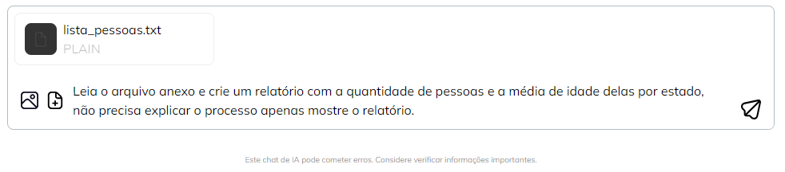

# Dados Externos
***São aquelas informações necessárias ou complementares que não estão disponíveis para consulta pública pela Inteligência Artificial (IA)***
 
Esta provavelmente é uma instrução, ou recurso, que eu uso muito, ou principalmente, com proMpts Tarefeiros, quando quero que a IA manipule alguma informação que é minha, não está disponível abertamente para consulta e, por tanto, a IA não conseguiria acessar sem um envio ou solicitação exclusiva para isso.

Por exemplo, imagine que eu tenho uma lista de participantes de um evento, que por algum motivo me foi fornecida em um [arquivo txt](../../recursos/exemplos/lista_pessoas.txt) e eu desejo saber a media de idade das pessoas desse evento. Eu poderia usar uma IA para isso, mas seria necessário fornecer essa lista.

Posso fazer isso, em geral, de duas formas, copiando e colando a lista como parte do proMpt.

```
Leia a lista abaixo e cálcule a idade média das pessoas na lista.

Nome: Mateus, Idade: 41, Cidade: São Paulo, Estado: SP
Nome: Rafael, Idade: 45, Cidade: Belo Horizonte, Estado: MG
Nome: Felipe, Idade: 40, Cidade: Belo Horizonte, Estado: MG
Nome: Ana, Idade: 22, Cidade: Natal, Estado: RN
Nome: Camila, Idade: 34, Cidade: Goiânia, Estado: GO
Nome: Roberto, Idade: 55, Cidade: Manaus, Estado: AM
Nome: Camila, Idade: 47, Cidade: Goiânia, Estado: GO
Nome: Maria, Idade: 35, Cidade: Curitiba, Estado: PR
Nome: Juliana, Idade: 72, Cidade: Recife, Estado: PE
Nome: Rafael, Idade: 23, Cidade: Curitiba, Estado: PR
Nome: Mariana, Idade: 58, Cidade: Recife, Estado: PE
Nome: Maria, Idade: 72, Cidade: Natal, Estado: RN
Nome: Rafael, Idade: 71, Cidade: Belém, Estado: PA
Nome: Paula, Idade: 38, Cidade: Maceió, Estado: AL
Nome: Lucas, Idade: 48, Cidade: São Paulo, Estado: SP
Nome: Mateus, Idade: 47, Cidade: Florianópolis, Estado: SC
Nome: Maria, Idade: 73, Cidade: Belo Horizonte, Estado: MG
Nome: Bruna, Idade: 43, Cidade: Curitiba, Estado: PR
Nome: Paula, Idade: 63, Cidade: Brasília, Estado: DF
Nome: Felipe, Idade: 58, Cidade: Belo Horizonte, Estado: MG
Nome: Pedro, Idade: 43, Cidade: Manaus, Estado: AM
Nome: Roberto, Idade: 80, Cidade: Porto Alegre, Estado: RS
Nome: Gabriel, Idade: 71, Cidade: Curitiba, Estado: PR
Nome: João, Idade: 37, Cidade: Maceió, Estado: AL
Nome: Gabriel, Idade: 22, Cidade: Salvador, Estado: BA
Nome: João, Idade: 78, Cidade: Curitiba, Estado: PR
Nome: Juliana, Idade: 65, Cidade: Goiânia, Estado: GO
Nome: Laura, Idade: 30, Cidade: Curitiba, Estado: PR
Nome: Roberto, Idade: 79, Cidade: Florianópolis, Estado: SC
Nome: Paula, Idade: 75, Cidade: Fortaleza, Estado: CE
```

Com essa simples estrutura, quase sem esforço, eu teria uma resposta sobre a média de idade de 30 pessoas da minha lista.

[](../../tipos-de-prompt/tarefeiro.md)

[](../../partes-de-prompt/acao.md) **Leia a lista abaixo e cálcule a idade média das pessoas**

[](../../partes-de-prompt/informacao/dados-externos.md) **Uma lista de trinta pessoas**

Perceba que a informação trabalhada pela IA não estaria disponível para ela, a menos que eu fornecesse. Aqui, cabe o cuidado legal e tecnico de investigar como o Agente de IA (Agente) que está sendo usado trata essas informações em relação a sigilo, confiabilidade, lgpd e afins. Além disso, a IA ainda pode cometer algum erro, então, dependendo importancia do uso desse resultado ele deveria ser revisado, mas, para usos mais comuns normalmente ela atenderá bem.

Todavia, em vez de "copiar e colar" a lista, hoje, grande parte dos agentes de IA permite que eu faça um upload (envio) de arquivos em minhas solicitações, então, outro exemplo seria o seguinte:



Nesse caso eu não precisei copiar, colar, ou digitar a lista, apenas anexei ao proMpt, que é uma forma comum de fornecer Dados Externos para os Agentes atuais. Aqui também temos um proMpt, mesmo pequeno, um pouco mais complexo e elaborado.

[](../../tipos-de-prompt/tarefeiro.md)

[](../../partes-de-prompt/acao.md) **Leia o arquivo anexo e crie um relatório com a quantidade de pessoas e a média de idade delas por estado**

[](../../partes-de-prompt/controle/limites.md) **não precisa explicar o processo apenas mostre o relatório.**

[](../../partes-de-prompt/informacao/dados-externos.md) **Arquivo ["lista_pessoas.txt"](../../recursos/exemplos/lista_pessoas.txt) anexado**

Adicionar Dados Externos ao proMpts que escreve, além de uma necessidade que será notável, é uma adequação ao Modelo GROW onde precisamos de informações para avaliar a Realidade atual em que determinada ação será aplicada.

Vale reforçar que a IA não é factual, mesmo recebendo dados reais, ela pode ter "alucinações" e gerar resultados erroneos, assim, cabe a nós, como humanos na relação, garantir a qualidade dessa informação gerada.

## Relações
<table>
<tr>
  <th>Componente</th>	<th>Método</th>	<th>Descrição</th>
</tr>
<tr>
  <td>Realidade</td><td>GROW</td><td> Indicação do contexto, da realidade, na qual o resultado do Prompt será aplicado.</td>
</tr>

</table>

## Referências
PERPLEXITY. GROW é um acrônimo para GOAL? Disponível em: https://www.perplexity.ai/search/grow-e-um-acronimo-para-goal-m-0Fvr6CKGRBOUOlngLHzf6g. Acesso em: 12 out. 2023.

