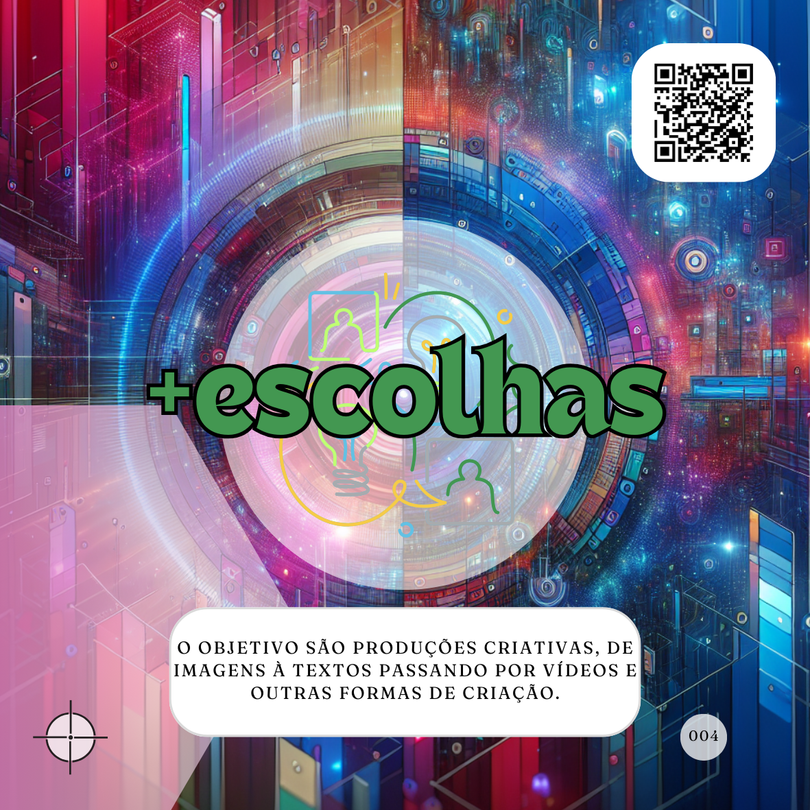

# O Básico bem feito
***Com poucos cuidados você pode passar a alcançar resultados muito melhores com o uso de Inteligência Artificial (IA).***

O primeiro passo para ter um bom proMpt é saber, realmente, qual é o seu objetivo. Isso pode tanto ajudar a escolher um Agente de IA (Agente) mais especializado quanto simplesmente a definir o tipo de proMpt que pretende escrever antes de começar.

Escolher um Agente mais adequado pode ser uma tarefa mais complexa, mas identificar o tipo de proMpt deve se tornar natural. Enquanto isso, lembre-se dos tipos fundamentais de proMpts:

[](tipos-de-prompt/tarefeiro.md) [](tipos-de-prompt/conselheiro.md) [](tipos-de-prompt/criativo.md) [](tipos-de-prompt/mais-escolhas.md)

## Melhorando o proMpt com passos simples
Definido o tipo de proMpt, você já terá meio caminho para uma solicitação mais efetiva. Por exemplo, se escolher o tipo "Conselheiro", os próximos passos poderiam ser:

### Exemplo inicial de proMpt Conselheiro:
```
Quais são as tendências de moda para o outono?
```

Aqui, o pedido é genérico, e a resposta será bastante ampla. Podemos melhorar muito o resultado aplicando três elementos simples: **Papel**, **Ação** e **Contexto**.

[](partes-de-prompt/papel.md)  
[](partes-de-prompt/acao.md)  
[](partes-de-prompt/contexto.md)

### Passo 1: Melhorando a Ação
```
Liste as principais tendências de moda masculina para o outono e dê exemplos de cada uma delas.
```

Agora, a ação está mais clara, reduzindo o escopo de "moda" para "moda masculina" e solicitando exemplos para enriquecer a resposta.

### Passo 2: Definindo o Papel
```
Como se você fosse um fashionista especialista em tendências para o dia a dia, liste as principais tendências de moda masculina para o outono e dê exemplos de cada uma delas.
```

Aqui, a IA assume o papel de um especialista, impactando o tom e a profundidade da resposta.

### Passo 3: Adicionando o Contexto
```
Estou refazendo o meu guarda-roupa e gostaria de ter um guarda-roupa cápsula com peças-chave para o uso diário. Como se você fosse um fashionista especialista em tendências para o dia a dia, liste as principais tendências de moda masculina para o outono e dê exemplos de cada uma delas.
```

Com o contexto, a resposta torna-se ainda mais focada, oferecendo sugestões alinhadas ao objetivo específico.

### Resultado final:
```
Estou refazendo o meu guarda-roupa e gostaria de ter um guarda-roupa cápsula com peças-chave para o uso diário. Como se você fosse um fashionista especialista em tendências para o dia a dia, liste as principais tendências de moda masculina para o outono e dê exemplos de cada uma delas.
```

Esse é um exemplo de **proMpt básico ideal**, que pode ser aprimorado conforme necessário. Usar **Papel, Ação e Contexto** é suficiente para a maioria das solicitações do dia a dia.

## Recursos visuais para o proMpt:
[](conselheiro.md)  
[](partes-de-prompt/acao.md)  
[](partes-de-prompt/papel.md)  
[](partes-de-prompt/contexto.md)

## Leia também
- [Tipos de proMpts e Agentes](tipos-de-prompt/README.md)
  - [Cocriando sua IA](tipos-de-prompt/cocriacao.md)
  - [Conselheiro](tipos-de-prompt/conselheiro.md)
- Partes de proMpts
  - [Papel](partes-de-prompt/papel.md)
  - [Ação](partes-de-prompt/acao.md)
  - [Contexto](partes-de-prompt/contexto.md)

<hr><p xmlns:cc="http://creativecommons.org/ns#" xmlns:dct="http://purl.org/dc/terms/"><a property="dct:title" rel="cc:attributionURL" href="https://davifma.github.io/proMpto/">prompto.github.io</a> by <a rel="cc:attributionURL dct:creator" property="cc:attributionName" href="http://linkedin.com/in/davifma">Davi Fontebasso Marques de Almeida</a> is licensed under <a href="https://creativecommons.org/licenses/by/4.0/?ref=chooser-v1" target="_blank" rel="license noopener noreferrer" style="display:inline-block;">Creative Commons Attribution 4.0 International </a></p>
