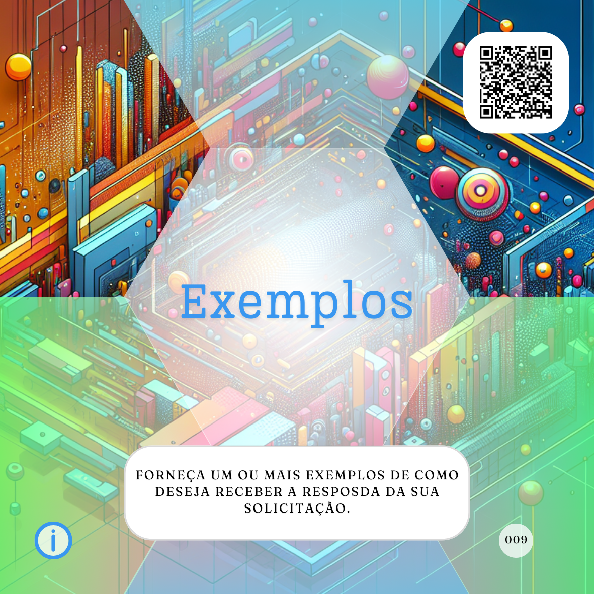

# Completo ou complexo?
***Quais são os elementos necessários para escrever o proMpt mais completo possível de solicitação para uma Inteligência Artificial (IA)?***

Na minha opinião, a resposta correta seria: aqueles que você precisar para chegar ao resultado esperado.

Mas essa resposta, por si só, não resolve muito. Após estudar frameworks como PACIF, PACEF, PREP e GROW e explorar materiais sobre engenharia de proMpts, ficou claro que, antes de pensar na escrita, é essencial compreender seu objetivo e natureza:

- **A solicitação é para uma tarefa simples?**
- **É um pedido de informação ou orientação?**
- **Envolve a criação de algo mais criativo, desafiador ou artístico?**
- **A resposta deve ser aberta ou limitada a algumas opções?**

Essas questões ajudam a definir o tipo de proMpt e são o primeiro passo para começar a escrever.

[](tipos-de-prompt/tarefeiro.md) [](tipos-de-prompt/conselheiro.md) [](tipos-de-prompt/criativo.md) [](tipos-de-prompt/mais-escolhas.md)

## Estrutura básica de um proMpt
Se sua solicitação não obteve o resultado esperado, reflita: incluí os elementos básicos? A IA entendeu como agir, o que fazer e onde aplicar o resultado? Se não, insira os seguintes componentes:

1. **Papel:** Define o papel que a IA deve desempenhar.  
[](partes-de-prompt/papel.md)

2. **Ação:** Detalha a tarefa ou resultado esperado.  
[](partes-de-prompt/acao.md)

3. **Contexto:** Esclarece o cenário ou objetivo da solicitação.  
[](partes-de-prompt/contexto.md)

### Exemplo básico
```
Estou refazendo o meu guarda-roupa e gostaria de ter um guarda-roupa cápsula com peças-chave para o uso diário. Como se você fosse um fashionista especialista em tendências para o dia a dia, liste as principais tendências de moda masculina para o outono e dê exemplos de cada uma delas.
```

- **Papel:** Fashionista especialista.  
- **Ação:** Listar tendências com exemplos.  
- **Contexto:** Refazendo o guarda-roupa para o outono.

## Tornando o proMpt mais completo
Se mesmo com os elementos básicos o resultado não atender, adicione informações que controlem e enriqueçam o resultado:

### Controle do formato
```
... liste as principais tendências de moda masculina para o outono e dê exemplos de cada uma delas, me mostre esse resultado em uma tabela em texto, cruzando peças e combinações.
```
[](partes-de-prompt/controle/formato.md)

### Inclusão de exemplos
```
... cruzando peças e combinações, como no exemplo abaixo:
Tendência 1  | Peça 01+Peça 02 | Combinação prática e versátil...
Tendência 2  | Peça 03+Peça 04 | Estilo casual e funcional...
```
[](partes-de-prompt/informacao/exemplos.md)

### Limitação do escopo
```
... cruzando peças e combinações, como no exemplo acima, sugerindo apenas cinco peças-chave no total.
```
[](partes-de-prompt/controle/limites.md)

## Estrutura final
```
Estou refazendo o meu guarda-roupa e gostaria de ter um guarda-roupa cápsula com peças-chave para o uso diário. Como se você fosse um fashionista especialista em tendências para o dia a dia, liste as principais tendências de moda masculina para o outono e dê exemplos de cada uma delas, me mostre esse resultado em uma tabela em texto, cruzando peças e combinações, como no exemplo abaixo, sugerindo apenas cinco peças-chave no total.
```

### Elementos utilizados:
- [](tipos-de-prompt/conselheiro.md)
- [](partes-de-prompt/acao.md)
- [](partes-de-prompt/papel.md)
- [](partes-de-prompt/contexto.md)
- [](partes-de-prompt/controle/formato.md)
- [](partes-de-prompt/informacao/exemplos.md)
- [](partes-de-prompt/controle/limites.md)

## Considerações finais
Quanto mais complexa a solicitação, mais específica deve ser a escrita do proMpt. Esses elementos ajudam a refinar e otimizar os resultados, mas lembre-se: as IAs generativas não são factuais. A curadoria dos resultados é sempre sua responsabilidade.

## Leia também
- [Tipos de proMpts e Agentes](tipos-de-prompt/README.md)
  - [Cocriando sua IA](tipos-de-prompt/cocriacao.md)
  - [O Básico bem feito](prompt-basico.md)
- Partes de proMpts
  - Para controlar mais o resultado:  
    - [Formato](partes-de-prompt/controle/formato.md)  
    - [Limites](partes-de-prompt/controle/limites.md)
  - Para informar melhor a IA:  
    - [Exemplos](partes-de-prompt/informacao/exemplos.md)  
    - [Limites](partes-de-prompt/controle/limites.md)

<hr><p xmlns:cc="http://creativecommons.org/ns#" xmlns:dct="http://purl.org/dc/terms/"><a property="dct:title" rel="cc:attributionURL" href="https://davifma.github.io/proMpto/">prompto.github.io</a> by <a rel="cc:attributionURL dct:creator" property="cc:attributionName" href="http://linkedin.com/in/davifma">Davi Fontebasso Marques de Almeida</a> is licensed under <a href="https://creativecommons.org/licenses/by/4.0/?ref=chooser-v1" target="_blank" rel="license noopener noreferrer" style="display:inline-block;">Creative Commons Attribution 4.0 International </a></p>
