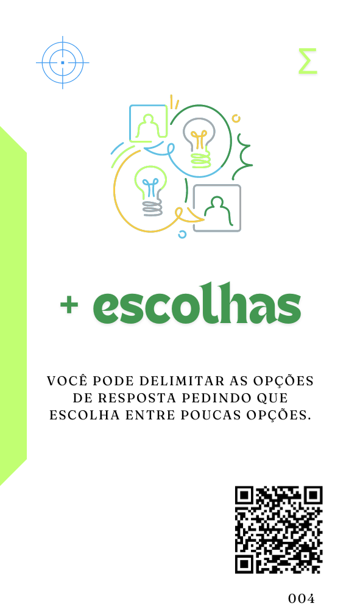
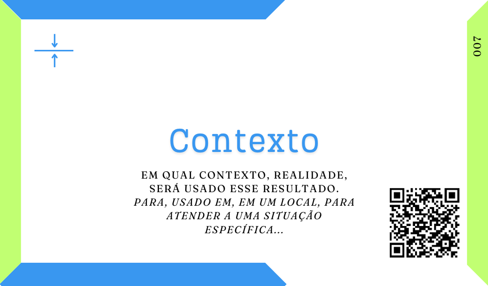
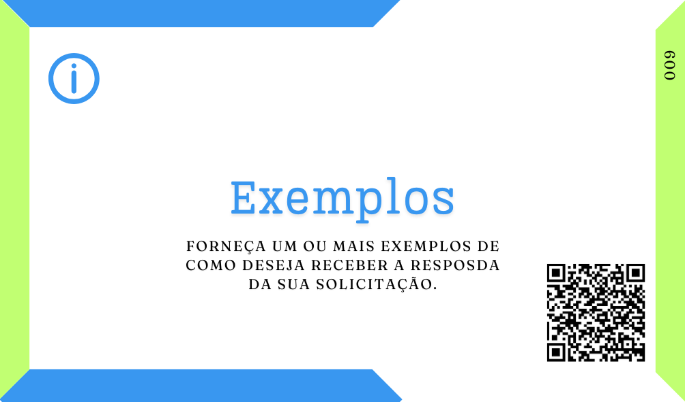
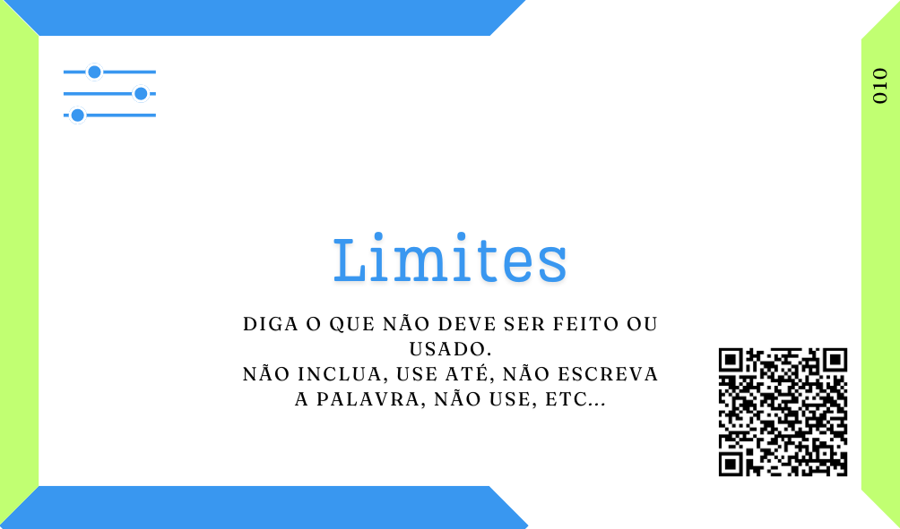

# Completo ou complexo?
***Quais são os elementos necessários para escrever o prompt mais completo possível de solicitaão para uma Inteligência Artificial (IA)?***

Na minha opnião, a resposta correta seria: aqueles que você precisar para chegar ao resultado esperado.

Mas, sim, isso não responde muita coisa. Todavia eu venho "mapeando" e estudando frameworks de escrita de prompts, como o PACIF, PACEF, PREP e até correlatos com o GROW e outros materiais sobre engenharia de prompts e venho sistematizando esses padrões de escrita de prompts.

Para mim, o que fica muito claro, é que antes de pensar na escrita do prompt, é necessário ter clareza do seu objetivo e natureza, ou seja, essa soliticação é para uma tarefa simples que deve ser realizada pela IA, ou seria um pedido de informação, uma orientação que eu gostaria de receber, ainda pode ser o pedido para produção de algo mais criativo e desafiador, talvez até artistico? Será que a resposta pode ser aberta, ou eu tenho um número limitado de opções dentre as quais a IA deverá escolher?

Esses são pontos fundamentais para você saber que tipo de prompt deseja criar, e a partir daí iniciar a sua redação.

[](tipos-de-prompt/tarefeiro.md) [](tipos-de-prompt/conselheiro.md) [](tipos-de-prompt/criativo.md) [](tipos-de-prompt/mais-escolhas.md) 

Definido isso já posso escrever o meu proMpt sem muita dor. Simplesmente vá lá e escreva. Se der certo ótimo, senão reflita, eu incluí os elementos básicos para alcançar o resultado desejado? Qual é a posição da IA sobre a minha solicitação? Eu disse como ela deveria agir? A atividade que ela deveria realizar está claro? É claro o que deve ser feito? E aplicação do resultado esperado? Está evidente em qual contexto essa resposta deve se encaixar? 

Se as repostas para essas perguntas for não, vale a pena inserir cada um desses elementos em sua solicitação. Na verdade, algumas vezes, inserir apenas um deles já deve surtir um efeito positivo, então (principalmente se tiver tempo) deveria experiêntar inserir um de cada vez para ver os resultados e suas diferenças.

[](partes-de-prompt/papel.md)

[](partes-de-prompt/acao.md)

[](partes-de-prompt/contexto.md)

Se, ainda assim, incluíndo esse corpo básico ao seu prompt você não alcançou o resultado esperado, então devemos estar falando de uma solicitação mais complexa, por tanto, que necessita de mais detalhes para atender a essa complexidade.

Copdemos incluir esses detalhes, como mais itens para controlar o resultado esperado e também mais informações que indiquem para a IA qual é esse resultado pretendido.

Vamos ver um exemplo.

```
Estou refazendo o meu guarda roupas e gostaria de ter um guarda roupas capsula com peças chaves para o uso diário como se você fosse um fashionista especialista em tendências para o dia a dia liste as principais tendências de moda masculina para o outono e de exemplos de cada uma delas.
```

Nesse prompt teriamos a seguinte estrutura já desenhada:

[](tipos-de-prompt/conselheiro.md) **Minha intenção é receber uma orientação sobre moda**

[](partes-de-prompt/acao.md) **A IA deve me dar exemplos par aum guarda roupas capsula de outono**

[](partes-de-prompt/papel.md) **A IA deve agir como um Fashionista especialista em dia-a-dia**

[](partes-de-prompt/contexto.md) **No momento estou refazendo o meu guarda-roupas para o outono**

Vamos acrescentar mais algumas informações para a IA poder trabalhar e trazer um resultado mais interessante.

```
Estou refazendo o meu guarda roupas e gostaria de ter um guarda roupas capsula com peças chaves para o uso diário como se você fosse um fashionista especialista em tendências para o dia a dia liste as principais tendências de moda masculina para o outono e de exemplos de cada uma delas, me mostre esse resultado em uma tabela em texto, fazendo um cruzamento entre as peças e as possíveis combinações.
```

Adicionamos

[](partes-de-prompt/controle/formato.md)  **me mostre esse resultado em uma tabela em texto, fazendo um cruzamento entre as peças e as possíveis combinações**

Provavelmente já teremos um resultado bem diferente, mas podemos dar mais informação para direcionarmos ainda mais esse resultado.

```
Estou refazendo o meu guarda roupas e gostaria de ter um guarda roupas capsula com peças chaves para o uso diário como se você fosse um fashionista especialista em tendências para o dia a dia liste as principais tendências de moda masculina para o outono e de exemplos de cada uma delas, me mostre esse resultado em uma tabela em texto, fazendo um cruzamento entre as peças e as possíveis combinações, como no exemplo abaixo

                Tendencia 1       Tendencia 2   Tendencia 3    Explicação
Tendencia 1     Peça01+Peça02     PeçaN+PeçaN   Peça?+Peça?    Essas combinações são assim por que...
Tendencia 2     Peça01+Peça03     Peça?+Peça?   Peça?+Peça?    Essas combinações são assim por que...
Tendencia 3     Peça01+Peça04     Peça?+Peça?   Peça?+Peça?    Essas combinações são assim por que...
...             ...               ...           ...            ...
Tendencia N     Peça??+Peça??     Peça?+Peça?   Peça?+Peça?    Essas combinações são assim por que...
```

Adicionar um exemplo pode ser a forma mais simples, no final, de direcionar corretamente a IA para o resultado que você espera.

[](partes-de-prompt/informacao/exemplos.md)  **como no exemplo abaixo (exemplo de tabela)**

Ainda poderiamos literalmente limitar as iformações a serem retornadas.

```
Estou refazendo o meu guarda roupas e gostaria de ter um guarda roupas capsula com peças chaves para o uso diário como se você fosse um fashionista especialista em tendências para o dia a dia liste as principais tendências de moda masculina para o outono e de exemplos de cada uma delas, me mostre esse resultado em uma tabela em texto, fazendo um cruzamento entre as peças e as possíveis combinações, como no exemplo abaixo sugerindo apenas cinco peças chave no total.

                Tendencia 1       Tendencia 2   Tendencia 3    Explicação
Tendencia 1     Peça01+Peça02     PeçaN+PeçaN   Peça?+Peça?    Essas combinações são assim por que...
Tendencia 2     Peça01+Peça03     Peça?+Peça?   Peça?+Peça?    Essas combinações são assim por que...
Tendencia 3     Peça01+Peça04     Peça?+Peça?   Peça?+Peça?    Essas combinações são assim por que...
...             ...               ...           ...            ...
Tendencia N     Peça??+Peça??     Peça?+Peça?   Peça?+Peça?    Essas combinações são assim por que...
```

Limitando as possibilidades algumas vezes você póderá ter um resultado mais realista, além disso, o mundo real traz suas limitações tmabém e é bastante válido repplicá-las em nossas tarefas e nas tarefas das IAs.

[](partes-de-prompt/controle/limites.md)  **sugerindo apenas cinco peças chave no total**

Aqui, nós usamos e temos uma estrutura de proMpt exemplificda bastante completa, que pode ser muito útil para solução de problemas mais complexos, é legal pensar que nem sempre todos esses elementos serão necessários e sua escolha deve passar a ser natural com o tempo e prática, mas esse pode ser um bom guia para melhorar o desempenho de seus prompts inicialmente, expeciamente se você não é uma pessoa de área tecnica acostumada com a escrita de logicas esse caminho pode ser bem mais natural e simples.

A estrutura que temos aqui seria algo como abaixo:

[](tipos-de-prompt/conselheiro.md) 

[](partes-de-prompt/acao.md) 

[](partes-de-prompt/papel.md) 

[](partes-de-prompt/contexto.md) 

[](partes-de-prompt/controle/formato.md)

[](partes-de-prompt/informacao/exemplos.md)

[](partes-de-prompt/controle/limites.md) 

Quanto mais complexa a sua necessidade, eu entendo que, mais específica deve ser a escrita dos seus proMpts e ter esses elementos, essas partes, possíveis para bum bom proMpt em mente certamente deve facilitar essa atividade. Além disso é sempre importante lembrar que os Agentes de IA (Agentes), sobretudo generativas, de alguma forma buscam imitar uma resposta humana, assim, trata-los de forma semelhante a um humando em nossas instruções também deve ajudar. 

Todavia, não importa o quão complexos e específicos sejam seus prompts sempre vale lembrar que o Humano de fato é você e, por isso, o responsável pelo uso do resultado gerado que pode não ser factual, as IAs, não são facutais assim cabendo sempre a curadoria desses resultados.

## Leia também
- [Tipos de proMpts e Agentes](tipos-de-prompt/README.md)
  - [Cocriando sua IA](tipos-de-prompt/cocriacao.md)
  - [O Básico bem feito](prompt-basico.md)
- Partes de proMpts
  - Para controlar mais o resultado 
    - [Formato](partes-de-prompt/controle/formato.md)
    - [Limites](partes-de-prompt/controle/limites.md)
  - Para informar melhor a Inteligência Artificial
    - [Exemplos](partes-de-prompt/informacao/exemplos.md)
    - [Limites](partes-de-prompt/controle/limites.md)
  


