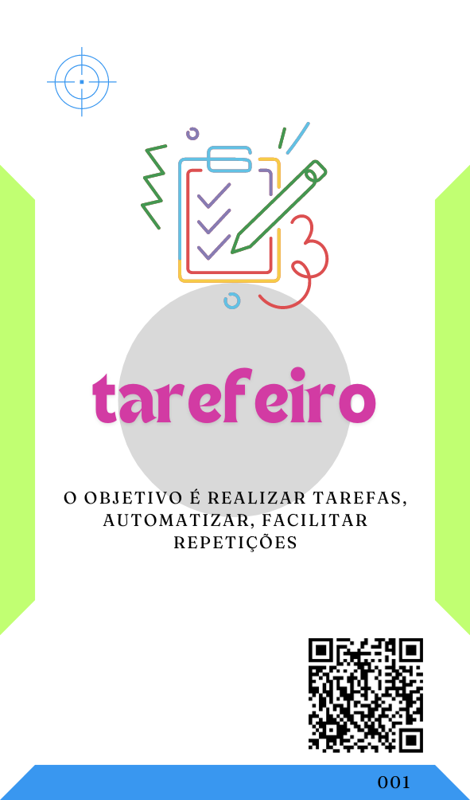

# Nasceu: Primeira Facilitação
***Decisão de uso sobre o uso de Inteligência Artifical (IA) em Grande Grupos.***

Bom, minha resposta sobre usar a IA é sempre "sim", devemos envolver a IA cada vez mais, sempre que possível. Para mim a questão deveria ser sobre "Como" envolver a IA. Ainda é uma questão mais delicada no contexto de equipe, se forem grandes grupos ainda mais.

Esse foi um dos desafios que me trouxe aqui, quase sempre, quando estava em algum evento ou facilitação e resolvia falar sobre IAs as questões levantadas e de interesse real eram sempre superficiais e as mesmas.

- Qual a melhor IA?
- Como escrever o melhor proMpt?
- Qual o melhor framework ou método para escrever proMpts?
- Tem algum proMpt proMtO?

E, confesso, essas perguntas recorrentes me frustravam em um primeiro momento. Então eu percebi que precisavamos, no geral, de alguma ferramenta de letramento e de estimulo ao uso intencional das IAs. Intencional, pois eu entendo que todos já usamos ou somos usados pelas IAs, querendo ou não.

Precisamos todos tomar a rédia dessa relação.

Dito isso, ontem eu coloquei em prática real essa ferramenta, pela primeira vez. E, devo dizer, gostei muito dos resultados e tive muitos aprendizados, igualmente.

Em um grupo de mais de 50 jovens estudantes universitários de tecnologia, com 15 equipes deles, cada uma com um projeto real a ser realizado e inertes em relação ao uso das IAs para a execussão desses projetos.

O primeiro ponto para facilitar esse processo de uso e evolução do uso das IAs foi um momento de contextualização, necessário para melhor mobilização também. Trouxe alguns Slides para me apoiar com isso.

 

Básicamente usei esses dois Slides para contar a mesma história que abriu esse texto. Em seguida entrei no que interessa, que é falar sobre as possibilidades que as IAs nos dão, culminando nos três tipos de base [tarefeiro](../../../../tipos-de-prompt/tarefeiro.md), [conselheiro](../../../../tipos-de-prompt/conselheiro.md) e [criativo](../../../../tipos-de-prompt/criativo.md).

Para apoiar essa construção e diálogo eu trouxe alguns Slides que intercalamos com a construção coletiva dos participantes.

    

Como podem notar pela sequência de imagens, iniciamos falando sobre os agentes de IA que todos já conheciam, então nós classificamos os seus usos e então eu demonstrei como todos esses possíveis usos findam nos três tipos base de uso que este material mapeia.

Entendo que esse trabalho maior de contextualização será necessário sempre que percebermos ausencia ou diferenças grandes de conhecimento no uso intencional de IAs, o objetivo aqui é deixar todo mundo na mesma página.

O próximo passo seria o [AI Planing Poker](../../../../tipos-de-prompt/cocriacao.md#ai-planing-poker).

>[!CAUTION]
> Aqui entendo que cometi um erro, devido a natureza acadêmica desse encontro eu pensei em usar a construção do baralho como recurso lúdico, como faço em outros casos, todavia aqui não há construção, as cartas, os passos, os tipos são sempre os mesmos três, por isso a experiência não foi tão rica e acabou tomando muito tempo.

Em alternativa, nas próximas vezes que eu não tiver as cartas impressas eu usarei o [smart-ai-planing-poker.pdf](../../../../recursos/ferramentas/smart-ai-planing-poker.pdf), basta pedir que todos baixem uma cópia em seus mobiles e, pronto, todos tem os recursos necessários para o jogo.

>[!NOTE]
>Enquanto escrevia este me ocorreu que outra solução seria usar a propria IA, como a [OratóriaFMA](http://bit.ly/oratoriafma) por exemplo, para criar as cartas, já explorando um pouco a construção de proMpts implicitamente.

De qualquer maneira, com as cartas em mãos seguimos para o [jogo](../../../../tipos-de-prompt/cocriacao.md#ai-planing-poker).

Com todos os participantes munidos de suas cartas representando os tres tipos basais de uso de IAs, nós iniciamos a [AI Planing Poker](../../../../tipos-de-prompt/cocriacao.md#ai-planing-poker) com um questionamento.

> Pensando no contexto geral dos nossos projetos qual dos três tipos de Agentes basais nos ajudariam mais? Escolham o agente em segredo entre os três e quando todos tiverem escolhido nós ergueremos as cartas.

Infelizmente, na empolgação da facilitação acabei não fotografando esse momento. Mas, todos ergueram e, no nosso caso, a maioria esmagadora escolheu o [conselheiro](../../../../tipos-de-prompt/conselheiro.md). Continuei questionando.

> Apenas quem escolheu o Conselheiro, como esse tipo de Agente pode nos ajudar?

Fui anotando as respostas. O segundo mais votado foi o [tarefeiro](../../../../tipos-de-prompt/tarefeiro.md), então repeti o processo.

> Apenas quem escolheu o Tarefeiro, como esse tipo de Agente pode nos ajudar?

Novamente anotei. Embora apenas uma pessoa tenha escolhido o criativo, precisamos ouví-la.

> Você, como esse o Criativo pode nos ajudar?

Anotei sua resposta e segui.

> Depois dessa conversa, alguém gostaria de alterar o Agente que escolheu? Não precisa dizer a alteração, apenas se gostaria de alterar.

Alguns sinalizaram que sim, então continuei.

> Todos mundo escolhe novamente o Agente que acredita ser mais útil em nossos projetos, não precisa mudar o que escolheu anteriormente, pode manter, mas se quiser também pode mudar.

Aguardei todos e mostramos. Novamente uma maioria esmagadora de [Conselheiros](../../../../tipos-de-prompt/conselheiro.md), um pouco mais de [Tarefeiros](../../../../tipos-de-prompt/tarefeiro.md) que antes e nenhum criativo agora.

Repeti e anotei.

> Apenas quem escolheu o Conselheiro, como esse tipo de Agente pode nos ajudar?
> Apenas quem escolheu o Tarefeiro, como esse tipo de Agente pode nos ajudar?
> Depois dessa conversa, alguém gostaria de alterar o Agente que escolheu?

Como todos sinalizaram que estavam satisfeitos e não queriam mudar então finalizamos. Qual o resultado?

Bom, primeiro tivemos um diagnóstico de qual seria o perfil do Agente, ou quais Agentes seriam mais úteis, para os projetos do ponto de vista dos envolvidos.

O grupo deixou bem claro que certamente uma IA com fortes características de [Conselheiro](../../../../tipos-de-prompt/conselheiro.md) seria o mais importante, mas algumas atividades de um [Tarefeiro](../../../../tipos-de-prompt/tarefeiro.md) seriam desejadas e talvez, com resalvas, o uso de um [Criativo](../../../../tipos-de-prompt/criativo.md).

Com base nisso, e nas ferramentas de IAs que já haviamos levantado no começo da conversa já podemos ter uma boa ideia de quais são as ferramentas mais recomendadas para adoção. 

Além disso, ainda tivemos um feedback claro de quais atividades seriam mais esperadas dessas IAs. Como um bonus imprevisto, dividias por áreas de conhecimento.

Como podemos ver, de cada perfil de agente esperasse algo:

## Expectativas de soluções por IA
<table>
  <tr>
 <td></td>
 <td></td>
 <td></td>
</tr>
<tr>
  <td>

    - Tirar dúvidas
    
    - Buscar soluções no Projeto

    - Aconselhar sobre as necessidades
    
    - Gerar Textos para o produto
    
    - Desenvolvimento:
    
      - Buscar bugs
 </td>
<td>
  Organizar a documentação
  
  Organizar as tarefas
  
  Desenvolvimento:
  - Gerar código
  - Correção de estruturas de código (normatização)
</td>
<td>
  Criar roteiros e rotinas
</td>
  </tr>
</table>

Assim, com uma ferramenta lúdica e rápida, excluindo meus erros de primeira facilitação, você consegue ter um diagnóstico muito claro sobre como realmente uma IA pode auxiliar a sua equipe e quais são, de fato, suas necessidades nesse cenário.
