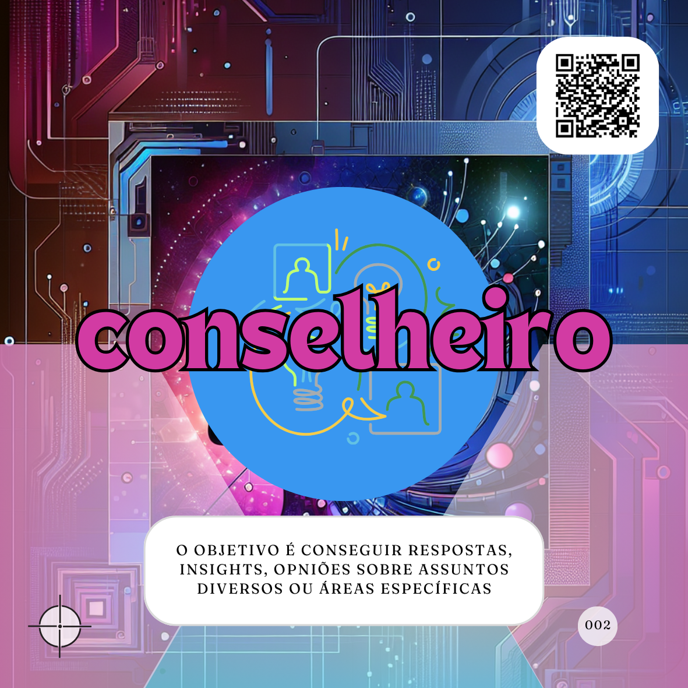

# Cocriando sua IA
***Reúna toda a equipe para descobrir como vocês podem usar a IA para melhorar o trabalho e ganhar tempo.***

Acredito que todos já deveriam estar usando Inteligências Artificiais (IAs) intencionalmente em suas atividades diárias. Na prática, muitos já as utilizam sem perceber. Entretanto, no ambiente profissional, é fundamental considerar os objetivos que se pretende alcançar com o uso da IA e os custos e benefícios associados.

Para facilitar diálogos sobre a adoção de IA em equipes, especialmente em contextos técnicos ou sensíveis, recomendo o uso de uma dinâmica estruturada como o **AI Planing Poker**.

## AI Planing Poker
Essa dinâmica é útil para:
- Decidir se um Agente de IA deve ser adotado em uma rotina.
- Determinar a natureza ideal do Agente.
- Facilitar o diálogo sobre custos e benefícios.

### Materiais necessários
- Cartas representando os tipos de proMpts: [Tarefeiro](tipos-de-prompt/tarefeiro.md), [Conselheiro](tipos-de-prompt/conselheiro.md) e [Criativo](tipos-de-prompt/criativo.md).
- Um quadro digital ou físico com representações das cartas.
- Um facilitador para guiar o diálogo e registrar os argumentos.

### Passo a passo
1. **Defina a situação**: O facilitador apresenta uma questão.  
   Exemplo:  
   *"Precisamos de ajuda para adotar novas metodologias em toda a organização. Qual seria o melhor tipo de IA para nos ajudar?"*

2. **Seleção das cartas**: Cada participante escolhe uma carta (Tarefeiro, Conselheiro ou Criativo) e a coloca virada para baixo no centro da mesa.  
   Quem acredita que IA não é aplicável mantém a carta virada para baixo.

3. **Revele as escolhas**: Todos viram as cartas ao mesmo tempo.  

4. **Inicie o diálogo**:  
   - Comece pelas cartas mais frequentes.  
     Exemplo: *"Por que vocês acreditam que um Agente Criativo seria o ideal?"*  
   - Depois, questione os outros tipos e os que não selecionaram nenhuma opção.  

5. **Nova rodada**: Pergunte se alguém deseja mudar de opinião com base no diálogo. Se sim, recolha as cartas e repita o processo.  

6. **Conclusão**: Após consenso ou término das rodadas, registre:
   - O tipo de Agente sugerido.
   - Os objetivos que ele deve alcançar.

### Exemplo prático
No exemplo apresentado, as rodadas poderiam gerar os seguintes resultados:  
1ª rodada:  
- 2 Criativos, 1 Conselheiro, 1 sem carta.  

2ª rodada:  
- 3 Conselheiros, 1 Criativo.

**Decisão final**:  
Agente ideal: **Conselheiro com capacidade criativa (Visionário Inspirador)**  
Objetivos:
- Personalizar processos.
- Descobrir melhores práticas.
- Simular metodologias.
- Criar materiais de treinamento e conteúdos personalizados.

Esses resultados orientam os próximos passos, como avaliar custos e benefícios da implementação.

## Benefícios da dinâmica
- Facilita a adoção da IA de forma colaborativa e estratégica.
- Identifica objetivos claros e específicos para o uso da IA.
- Promove alinhamento da equipe quanto às expectativas e limitações da tecnologia.

### Produtos gerados
1. **Tipo do Agente sugerido**:  
   

2. **Lista de objetivos para o Agente**:
   - Facilitar a personalização dos processos.
   - Descobrir melhores práticas para aplicação das metodologias.
   - Simular metodologias.
   - Criar materiais de treinamento e conteúdos personalizados.

## Relações
| Componente         | Método  | Descrição                                                    |
|---------------------|---------|------------------------------------------------------------|
| **Meta (Goal)**     | Grow    | Definição clara do objetivo geral do uso da IA.            |
| **Objetivos (OKR)** | OKR     | Detalhamento das metas específicas e mensuráveis.          |
| **Vontade (Will)**  | Grow    | Compromisso e acompanhamento das ações relacionadas à IA.  |
| **Resultados Chave (Key Results)** | OKR | Medição dos benefícios alcançados com a IA. |

## Referências
MARQUES DE ALMEIDA, DAVI FONTEBASSO. **OKR, um guia de navegação: Como você sabe se sua empresa está na direção certa?** 2022. Disponível em: [Amazon](https://www.amazon.com.br/dp/B09SW2VTM6).  
PERPLEXITY. **GROW é um acrônimo para GOAL?** Disponível em: [Perplexity AI](https://www.perplexity.ai/search/grow-e-um-acronimo-para-goal-m-0Fvr6CKGRBOUOlngLHzf6g).  

<a property="dct:title" rel="cc:attributionURL" href="https://davifma.github.io/proMpto/">prompto.github.io</a> by <a rel="cc:attributionURL dct:creator" property="cc:attributionName" href="http://linkedin.com/in/davifma">Davi Fontebasso Marques de Almeida</a> is licensed under <a href="https://creativecommons.org/licenses/by/4.0/?ref=chooser-v1" target="_blank" rel="license noopener noreferrer" style="display:inline-block;">Creative Commons Attribution 4.0 International </a>

