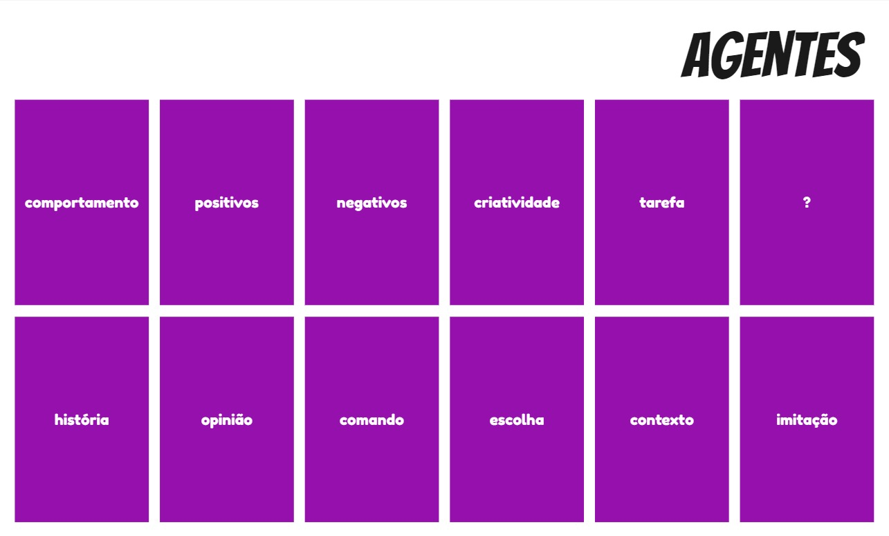
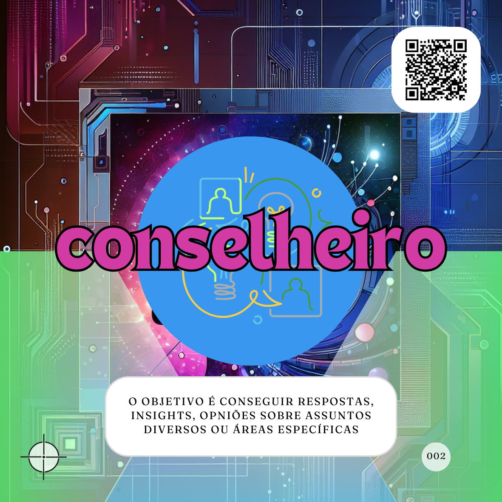
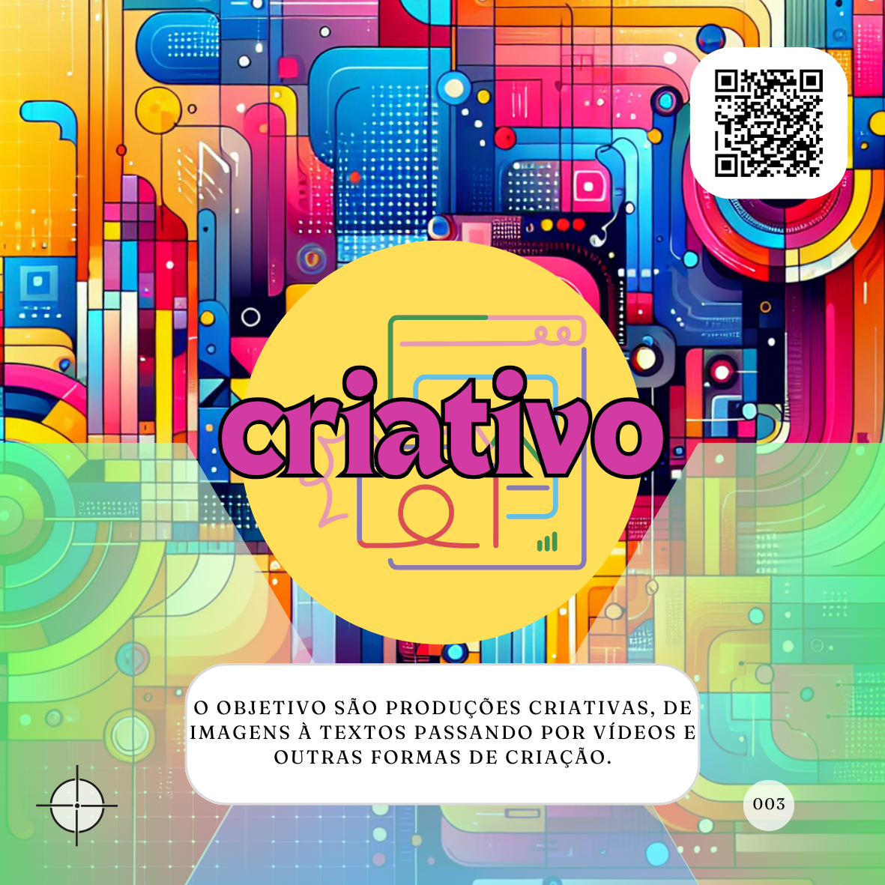
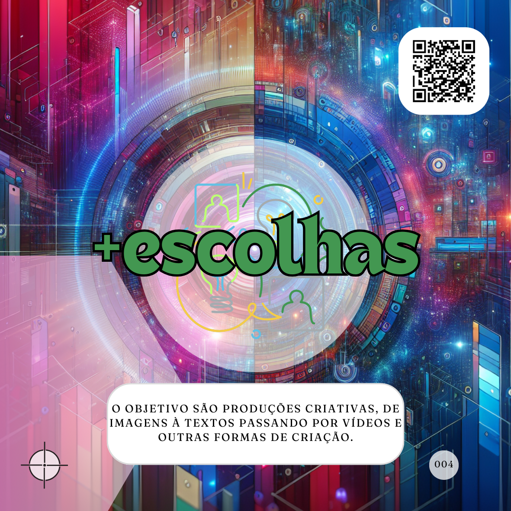
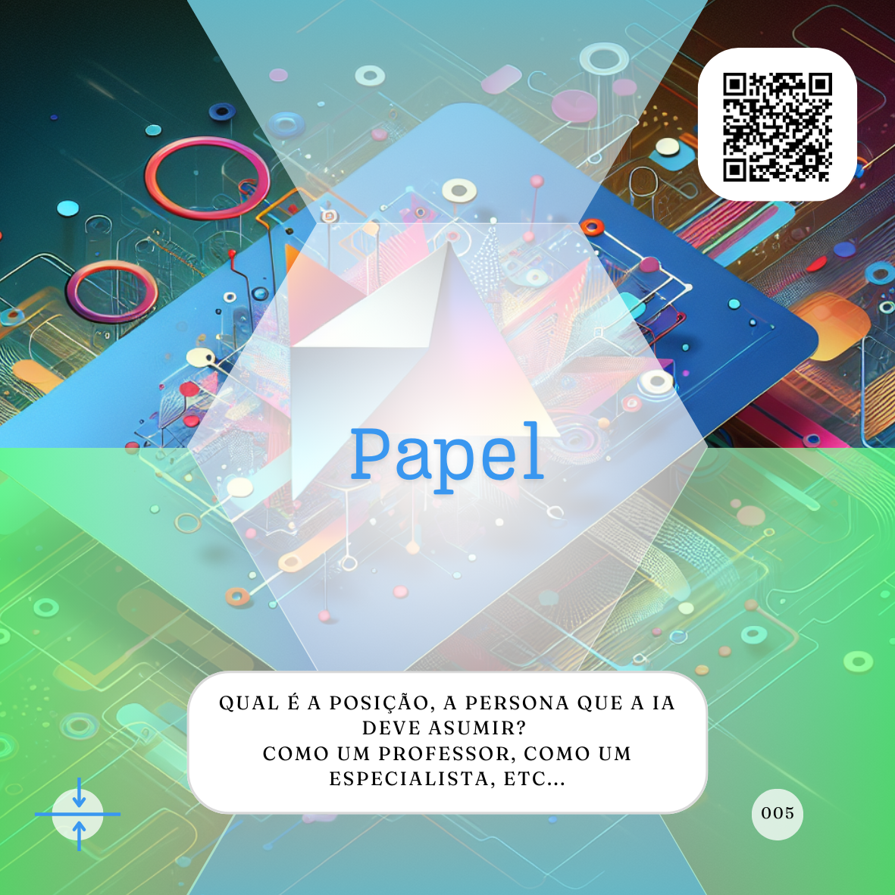
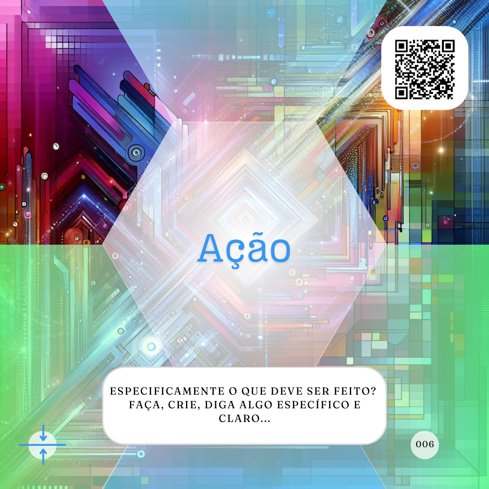
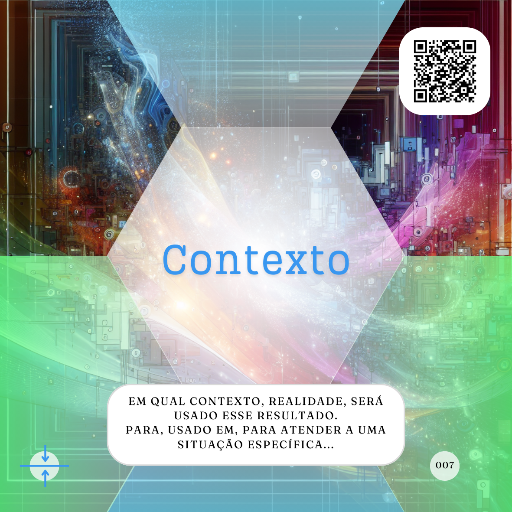
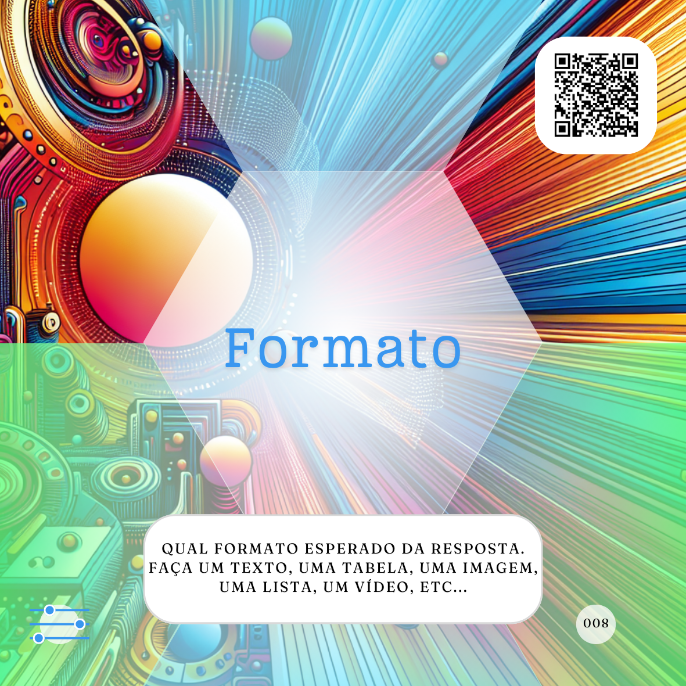
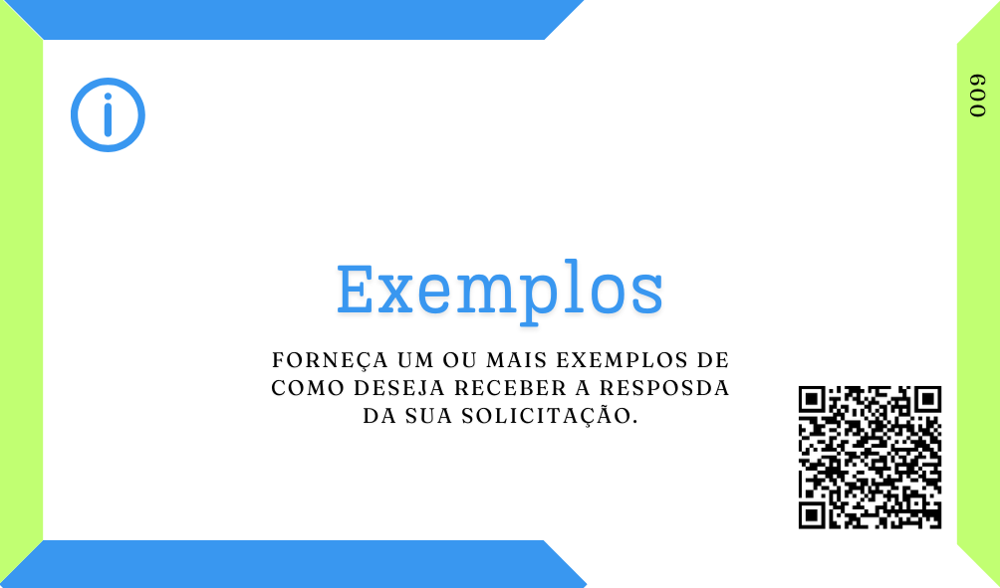
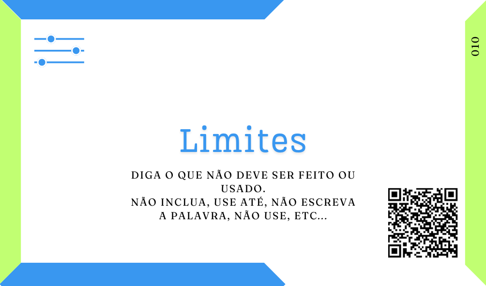

# Um mapa para infinitos proMpts
***"O mapa não é o caminho" é uma das minhas frases prediletas, não posso te dizer o "caminho" mas vou ajudar a encontrá-lo e a passar por ele com o uso de Inteligência Atificial (IA).***

Neste material você encontra uma coleção de tipos e partes para a criação de proMpts e Agentes de IA (Agentes) por meio desses proMpts, eu comecei a desenvolvê-lo, pois sempre que levavamos o assunto IA para dinâmicas abertas ou momentos de aprendizagem, muito menos importante do que as discussões éticas e culturais que queriamos criar, a mesma dor aparecia na fala dos participantes:

 \- *Qual é o/a melhor arquitetura/método/fórmula para escrever o melhor proMpt?*

Então entendi que umas das resistências para o uso intencional da IA (sim, todo mundo já usa, ou é usado, sem perceber) é o desconhecimento e um certo misticismo sobre a "arquitetura de proMpts", ou sobre o quão complexo é o uso das IAs.

Por isso eu trago tipos básicos de proMpts, ou seja, para o que você pode usar uma IA? Embora eu tenha mapeado pelo menos 10 usos mais comuns da IA, ou os 10 tipos de Agentes mais usados em minha breve pesquisa eu também entendo que isso é uma extrapolação das necessidades que nos levam ao uso da IA. 

Assim eu acabo afunilando, relacionando, todos esses usos a três tipos básicos para proMpts ou agentes, e é simples, buscamos as IAs para realizar tarefas simples, demoradas ou repetitivas em nosso lugar, para nos trazer informações e direcionamentos sobre assuntos nos quais presimos de apoio e para criar artefatos que consumiriam nosso tempo ou que não temos o conhecimento técnico ou talento necessário para criá-los sozinhos.

    

Você ainda pode ter a necessidade de diminuir a possibilidade de respostas que esses Agentes vão te trazer, por isso adicionei "mais escolhas". Esse [**Caminho da Consciência**](tipos-de-prompt/README.md) eu considero como o Trilha Básica  ou Inícial para trabalhamos com IAs, seguindo a analogia do mapa, antes de desenharmos a nossa rota precisamos saber para onde desejamos ir, qual será o destino, ter **consciência** dos nossos objetivos, esse Deck nos ajuda a pensar nisso, inclusive permitindo cocriar essconhecimento com nossos times usando um [**AI Planing Poker**](tipos-de-prompt/cocriacao.md#ai-planing-poker) por exemplo.

Vale pensarmos, a IA é só a ferramenta, ela não é o fim, ela é o caminho. Antes de decidirmos o caminho é necessário sabermos o fim desejado, qual o meu objetivo, essa primeira parte do nosso mapa pretende ajudar nessa decisão consciente.

Em alguns tipos de jornadas ou viagens alguns passos são quase obrigatórios, pessoas muito preparadas ou experientes normalmente conseguem pular ou transcender esses passos, ou ainda, os fazem tão facilmente que parecem não acontecer. Mas, se estamos iniciando nesse tipo de jornada, se é nossa primeira trilha pelas momtanhas de possibilidades da IA é necessário termos uma clareza dos primeiros passos, ou a base para comecarmos nossa caminhada.

De mais de 40 passos, ou partes, para uma boa escrita de proMpts em teoria, observando as possíveis cobinações, coincidências e utilidade eu percebi que apenas três são basais, quase obrigatório, e farão a diferença na maioria dos proMpts que você for escrever. 

Indicar qual é a função, qual papel, a IA esta desempenhando naquele momento, definir uma ação clara para a IA realizar e indicar o contexto no qual aquilo está acontecendo e será aplicado.

Embora sejam Cards do **Caminho da Produção** essas partes básicas para um bom proMpt somadas ao [**Caminho da Consciência**](tipos-de-prompt/README.md) seriam o que podemos chamar de **Trilha Básica **, tendo a intenção de lembra-lo do que é necessário para fazer o "[básico bem feito](prompt-basico.md)" e ter uma jornada mais efetiva e proveitosa. 

De verdade, para a maioria dos meus casos de uso de IA esse Deck é uma boa representação dos elementos que compõem esses proMpts.

Porém em muitos momentos podemos necessitar de bem mais especificidade para alcançarmos o resultado desejado em nossas consultas às IAs generativas, por isso nosso mapa tem muito mais indicações para que você possa fazer esse caminho com mais facilidade, esses são os demais Cards do nosso **Deack de Produção**.

Indicar em qual Formato você deseja essa resposta, dar Exemplos da resposta esperada, definir Limites e restrições para a resposta que seja sugerida, ter claro o foco e protagonismo no Assunto do que será criado, definir um Equipamento que a IA deve simular (ou usar) em sua resposta e, por fim, fornecer Dados Externos ao ecossistema que o Agente tem acesso autônomo para serem trabalhados, são elementos que podem enriquecer muito os resultados. 

Esses elementos também representam os Cards de abertura de nossos **Decks de Controle, Informação e Criação**, perceba que além das funções diferentes, temos indicações de que nem sempre seu uso será necessário, ou seja, será preciso pesar o que está faltando no seu proMpt para chegar ao resultado esperado.

- Você precisa definir melhor a forma como o resultado está sendo entregue ou exibido?
- Você tem disponícel ou pode criar facilmente um exemplo de como a resposta da IA deve ser?
- Existem limitações das quais a IA precisa ser informada para te dar um resultado mais adequado?
- Qual é o foco, o ponto principal, que deseja que a IA mostre nessa criação?
- Você está tentando simular (ou deseja que a IA use) um equipamento real para essa criação?
- A IA precisa ter acesso a dados que não estão disponíveis públicamente para atender a sua solicitação?

Essas são algumas perguntas que você pode se fazer, que são representações desses Cards e possíveis variações no trajeto que está percorrendo, levando a lugares, resultados, diferentes.

Assim, neste ponto já temos um guia bastante completo para as nossas aventuras pelos caminhos das IAs.

    

Embora, baseado nesse número de Cards, eu pudesse pensar que esse mapa poderia me levar apenas em 6.227.020.800 direções (ou combinações), se eu somar a essas combinações as infindáveis ideias que o seu cérebro humano pode ter para cada uma dessas peças, então eu posso afirmar sem medo algum que este é um mapa para você escrever infinitos proMpts de qualidade.

Esses elementos ainda reforçam a importância da especificidade nas suas solicitações e são um facilitador para que às consiga.

Todavia, ainda cabe lembrar, que não importa o quão bem escrita seja uma instrução para uma IA generativa, elas não são factuais e podem gerar respostas incorretas e irreais, então cabe a você enquanto humano lembrar-se disso e realizar a curadoria desses resultados.
## Leia também
- ### [Cocriação de Agentes de IA](tipos-de-prompt/cocriacao.md)
  - #### [Tipos de proMpt ou Agentes](tipos-de-prompt/README.md)
    - [Tarefeiro](tipos-de-prompt/tarefeiro.md)
    - [Conselheiro](tipos-de-prompt/conselheiro.md)
    - [Criativo](tipos-de-prompt/criativo.md)
    - [mais escolhas](tipos-de-prompt/mais-escolhas.md)
- ### Caminho da Produção
  - #### [O Básico bem feito](prompt-basico.md) 
    - [Papel](partes-de-prompt/papel.md)
    - [Ação](partes-de-prompt/acao.md)
    - [Contexto](partes-de-prompt/contexto.md)
  - #### [Completo ou complexo?](prompts-complexos.md) 
    - ##### Controle
      - [Formato](partes-de-prompt/controle/formato.md)
      - [Limites](partes-de-prompt/controle/limites.md)
    - ##### Informação
      - [Exemplos](partes-de-prompt/informacao/exemplos.md)
      - [Limites](partes-de-prompt/controle/limites.md)
    - ##### Criação
      - [Formato](partes-de-prompt/controle/formato.md)
      - [Formato](partes-de-prompt/ciacao/assunto.md)
