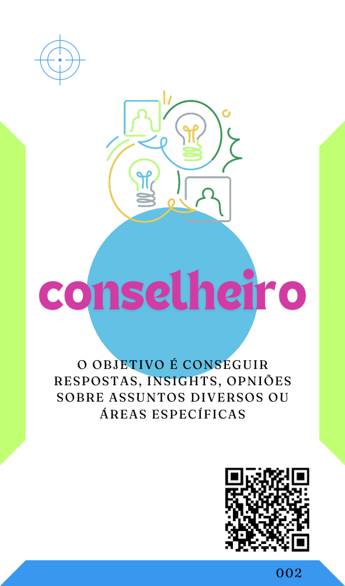
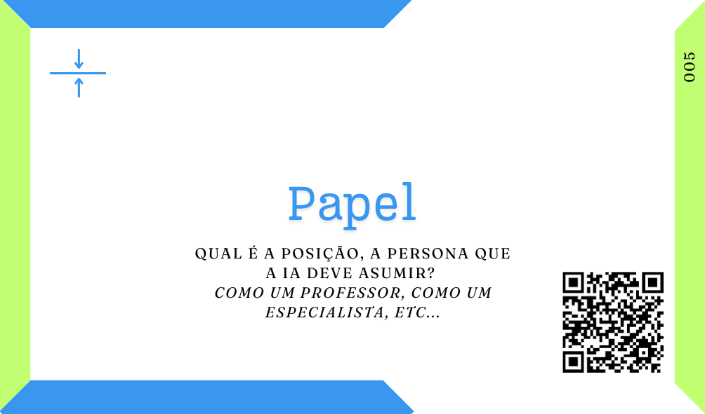
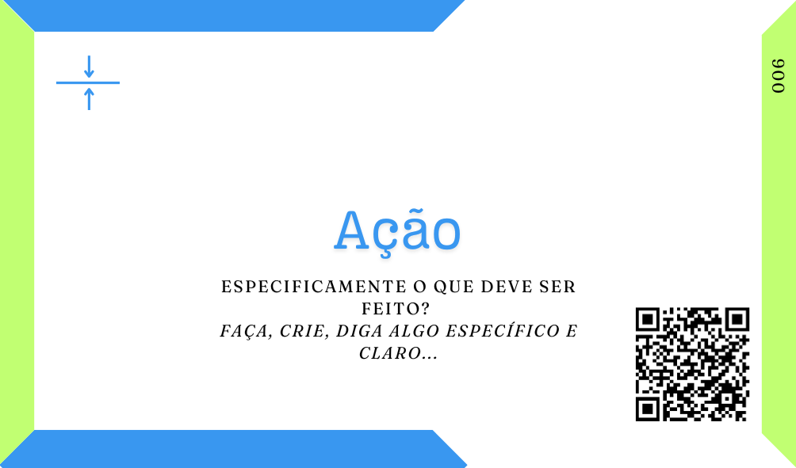

# Um mapa para infinitos proMpts
***"O mapa não é o caminho" é uma das minhas frases prediletas, não posso te dizer o "caminho" mas vou ajudar a encontrá-lo e a passar por ele com o uso de Inteligência Atificial (IA).***

Neste material você encontra uma coleção de tipos e partes para a criação de proMpts e Agentes de IA (Agentes) por meio de proMpts também, eu comecei a desenvolvê-lo, pois sempre que levavamos o assunto IA para dinâmicas abertas ou momentos de aprendizagem, muito menos importante do que as discussões éticas e culturais que queriamos criar, a mesma dor aparecia na fala dos participantes:

 \- *Qual é o/a melhor arquitetura/método/fórmula para escrever o melhor proMpt?*

Então entendi que umas das resistências para o uso intencional da IA (sim, todo mundo já usa, ou é usado, sem perceber) é o desconhecimento e um certo misticismo sobre a "arquitetura de proMpts", ou sobre o quão complexo é o uso das IAs.

Por isso eu trago tipos básicos de prompts, ou seja, para o que você pode usar uma IA? Embora eu tenha mapeado pelo menos 10 usos mais comuns da IA, ou os 10 tipos de Agentes mais usados em minha breve pesquisa eu também entendo que isso é uma extrapolação das necessidades que nos levam ao uso da IA. 

Assim eu acabo afunilando, relacionando, todos esses usos a três tipos básicos para proMpts ou agentes, e é simples, buscamos as IAs para realizar tarefas simples, demoradas ou repetitivas em nosso lugar, para nos trazer informações e direcionamentos sobre assuntos nos quais presimos de apoio e para criar artefatos que consumiriam nosso tempo ou que não temos o conhecimento técnico ou talento necessário para criá-los sozinhos.

    

Você ainda pode ter a necessidade de diminuir a possibilidade de respostas que esses Agentes vão te trazer, por isso adicionei "mais escolhas". Esse Deck eu considero como o Deck Básico ou Inícial para trabalhamos com IAs, seguindo a analogia do mapa, antes de desenharmos a nossa rota precisamos saber para onde desejamos ir, qual será o destino, esse Deck nos ajuda a pensar nisso, inclusive permitindo cocriar essa decisão com nossos times usando um [AI Planing Poker](tipos-de-prompt/cocriacao.md#ai-planing-poker) por exemplo.

Vale pensarmos, a IA é só a ferramenta, ela não é o fim, ela é o caminho. Antes de decidirmos o caminho é necessário sabermos o fim desejado, qual o meu objetivo, essa primeira parte do nosso mapa pretende ajudar nessa decisão.

Em alguns tipos de jornadas ou viagens alguns passos são quase obrigatórios, pessoas muito preparadas ou experientes normalmente conseguem pular ou transcender esses passos, ou ainda, os fazem tão facilmente que parecem não acontecer. Mas, se estamos iniciando nesse tipo de jornada, se é nossa primeira trilha pelas momtanhas de possibilidades da IA é necessário termos uma clareza dos primeiros passos, ou a base para comecarmos nossa caminhada.

De mais de 40 passos, ou partes, para uma boa escrita de proMpts em teoria, observando as possíveis cobinações, coincidências e utilidade eu percebi que apenas três são básicos e farão a diferença na maioria dos prompts que você for escrever. 

Indicar qual é a função, qual papel, a IA esta desempenhando naquele momento, definir uma ação clara para a IA realizar e indicar o contexto no qual aquilo está acontecendo e será aplicado.

Esse Deck de partes básicas para um bom proMpt tem a intenção de lembra-lo do que é necessário para fazer o "[básico bem feito](prompt-basico.md)" e ter uma jornada mais efetiva e proveitosa.

