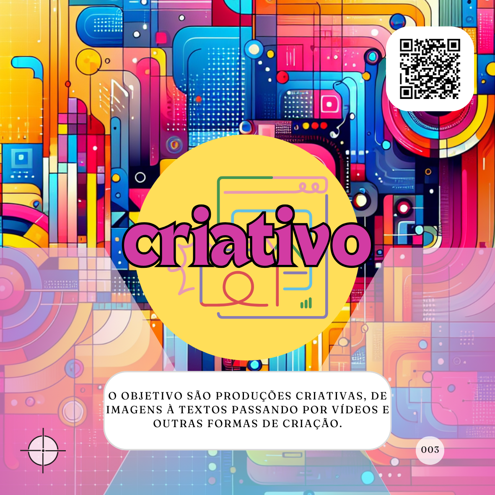
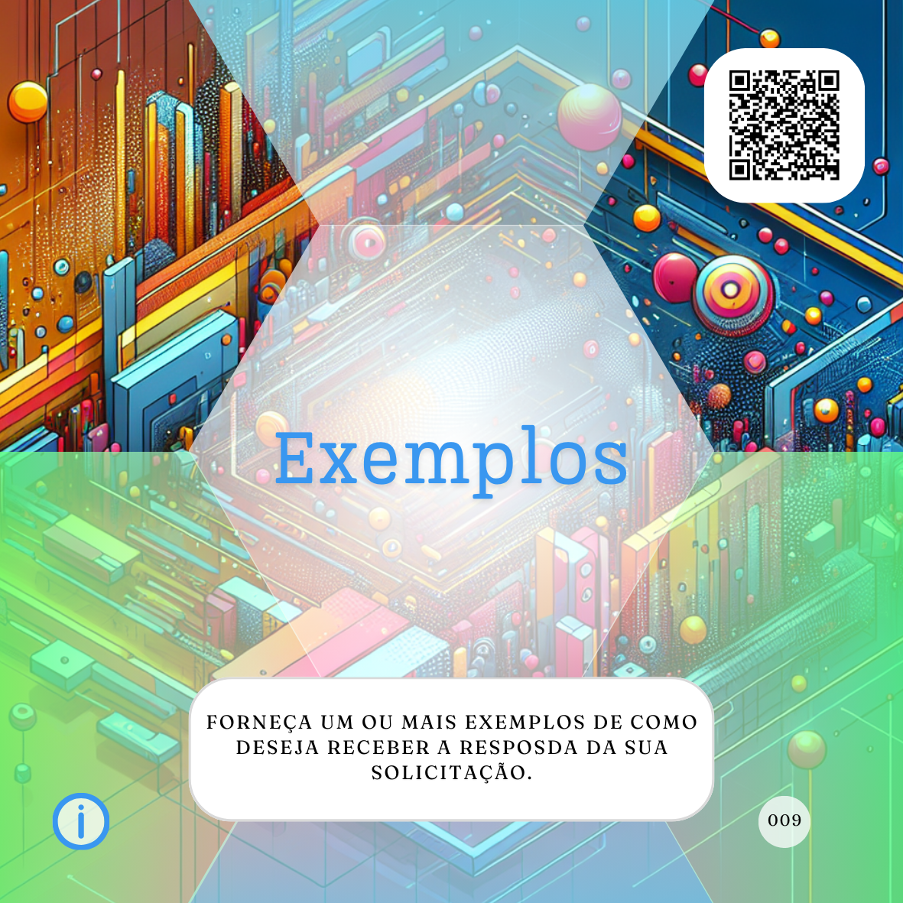
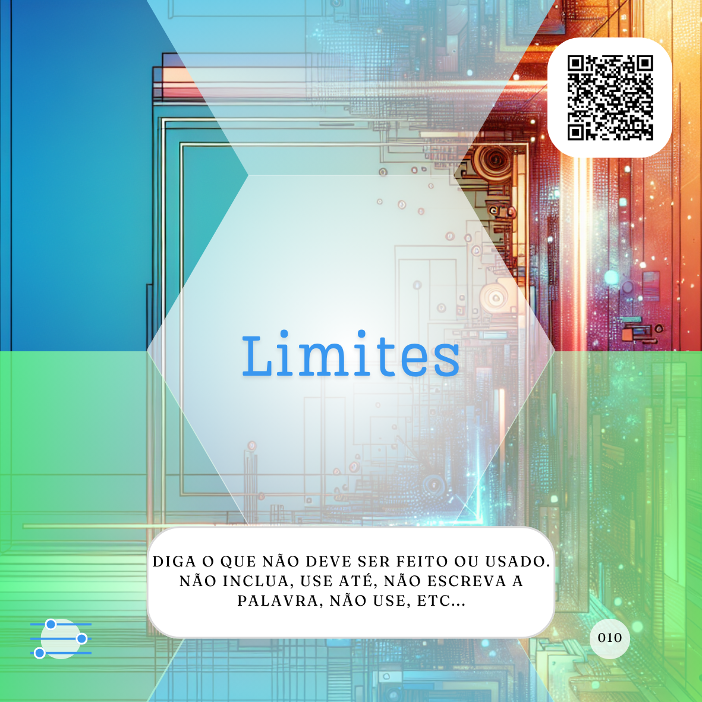
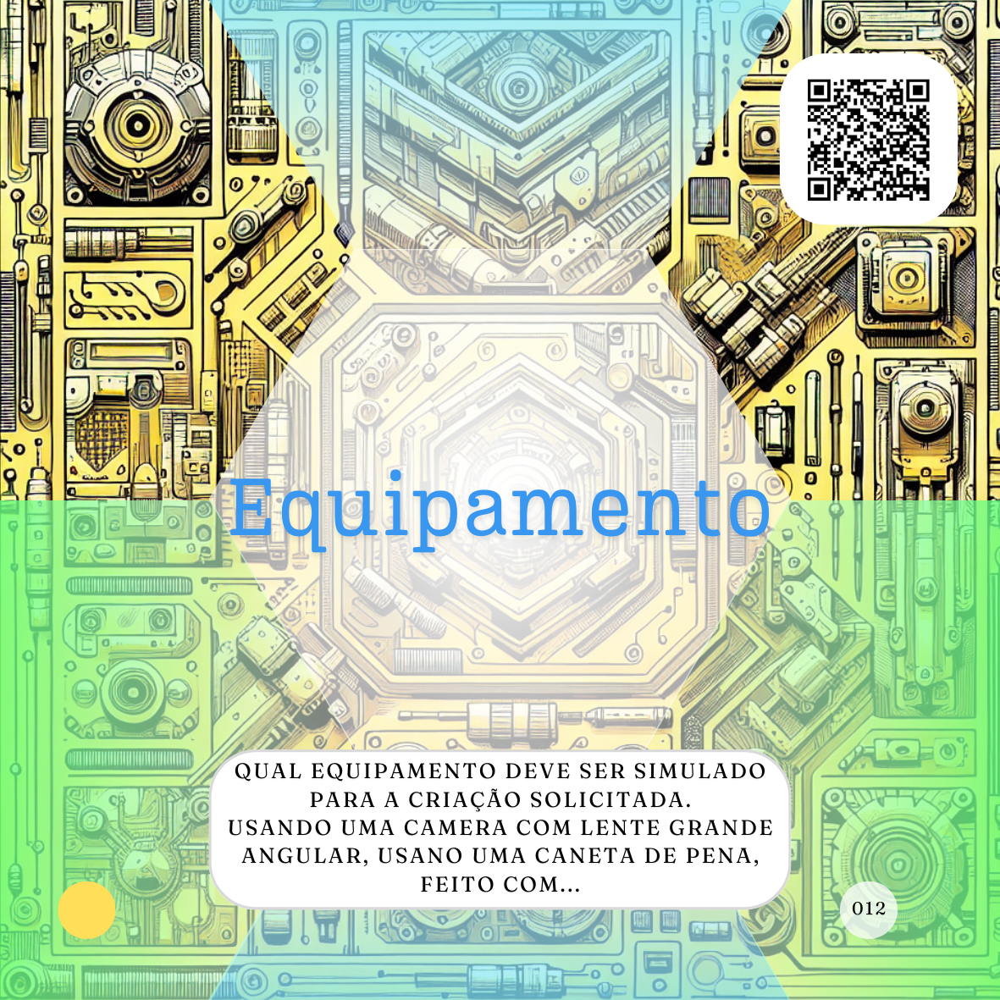

# Um mapa para infinitos proMpts

***"O mapa não é o caminho" é uma das minhas frases prediletas. Não posso te dizer o "caminho", mas vou ajudar a encontrá-lo e a passar por ele com o uso de Inteligência Artificial (IA).***

Neste material, você encontra uma coleção de tipos e partes para a criação de proMpts e Agentes de IA por meio desses proMpts. Comecei a desenvolvê-lo, pois, em dinâmicas abertas ou momentos de aprendizagem sobre IA, uma dor recorrente sempre surge entre os participantes:

\- *Qual é o/a melhor arquitetura/método/fórmula para escrever o melhor proMpt?*

Percebi que uma das resistências ao uso intencional da IA é o desconhecimento ou misticismo sobre a "arquitetura de proMpts" e a falsa ideia de que o uso da IA é complexo.

## Tipos básicos de proMpts
Embora tenha mapeado ao menos 10 usos comuns da IA e tipos de Agentes mais populares, todos esses casos podem ser resumidos em três tipos básicos de proMpts:

1. **Tarefeiro:** Realiza tarefas simples, demoradas ou repetitivas.
2. **Conselheiro:** Fornece informações e orientações.
3. **Criativo:** Cria artefatos como imagens, textos ou vídeos.

  
  

Adicionalmente, existe o modificador **"mais escolhas"**, que reduz as possibilidades de resposta, tornando-a mais focada:

## Partes essenciais de um proMpt
De mais de 40 elementos teóricos para a construção de um proMpt, observei que apenas três são fundamentais para a maioria dos casos:

1. **Papel:** Define a função que a IA desempenhará.
2. **Ação:** Indica a tarefa a ser realizada.
3. **Contexto:** Fornece o ambiente e os detalhes da aplicação.

  
  

Esses três elementos compõem a **Trilha Básica**, que ajuda a garantir o "[básico bem feito](prompt-basico.md)" em sua jornada com IA.

## Avançando nos proMpts
Para resultados mais específicos, é possível incorporar elementos adicionais que enriquecem as solicitações:

- **Formato:** Especifica a estrutura da resposta.  
  
- **Exemplos:** Fornece referências do resultado esperado.  
  
- **Limites:** Define restrições ou condições para a resposta.  
  
- **Assunto:** Foco principal da criação.  
  
- **Equipamento:** Simula ferramentas ou dispositivos.  
  
- **Dados externos:** Fornece informações adicionais à IA.  

## Reflexões sobre o uso de IA
Antes de escrever um proMpt, é essencial refletir:

1. **Quais benefícios terei?** Avalie o impacto qualitativo e financeiro.
2. **Quanto vou gastar?** Considere o custo em dinheiro e tempo.
3. **Custo vs. Benefício:** O saldo deve ser positivo, resultando em um ganho real de vida.

Esses questionamentos e elementos garantem um uso mais consciente e eficiente da IA, levando a melhores resultados.

## Leia também
- ### [Cocriação de Agentes de IA](tipos-de-prompt/cocriacao.md)
  - #### [Tipos de proMpt ou Agentes](tipos-de-prompt/README.md)
    - [Tarefeiro](tipos-de-prompt/tarefeiro.md)
    - [Conselheiro](tipos-de-prompt/conselheiro.md)
    - [Criativo](tipos-de-prompt/criativo.md)
    - [Mais escolhas](tipos-de-prompt/mais-escolhas.md)
- ### Caminho da Produção
  - #### [O Básico bem feito](prompt-basico.md) 
    - [Papel](partes-de-prompt/papel.md)
    - [Ação](partes-de-prompt/acao.md)
    - [Contexto](partes-de-prompt/contexto.md)
  - #### [Completo ou complexo?](prompts-complexos.md) 
    - ##### Controle
      - [Formato](partes-de-prompt/controle/formato.md)
      - [Limites](partes-de-prompt/controle/limites.md)
    - ##### Informação
      - [Exemplos](partes-de-prompt/informacao/exemplos.md)
      - [Limites](partes-de-prompt/controle/limites.md)
    - ##### Criação
      - [Formato](partes-de-prompt/controle/formato.md)
      - [Formato](partes-de-prompt/criacao/assunto.md)

<a property="dct:title" rel="cc:attributionURL" href="https://davifma.github.io/proMpto/">prompto.github.io</a> by <a rel="cc:attributionURL dct:creator" property="cc:attributionName" href="http://linkedin.com/in/davifma">Davi Fontebasso Marques de Almeida</a> is licensed under <a href="https://creativecommons.org/licenses/by/4.0/?ref=chooser-v1" target="_blank" rel="license noopener noreferrer" style="display:inline-block;">Creative Commons Attribution 4.0 International </a>

